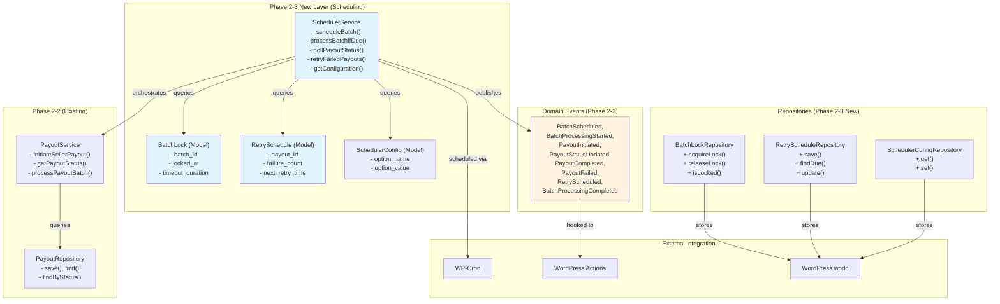

# Phase 2-3: Payout Scheduler Service Implementation Plan

**Objective**: Implement automated scheduled payout processing with status polling, retry scheduling, and WP-Cron integration

**Outcome**: SchedulerService orchestrating payout execution on schedule with exponential backoff retry logic and real-time status updates

**Estimated Effort**: 40-50 hours  
**Timeline**: 1-2 weeks  
**Team**: 1 Senior Developer

---

## 1. Executive Summary

### Problem Statement

Phase 2-2 provides manual payout initiation and status queries. Phase 2-3 automates the complete payout lifecycle:

- ❌ Payouts require manual scheduling (admin runs processPayoutBatch() manually)
- ❌ Failed payouts don't automatically retry
- ❌ Status updates require manual polling
- ❌ No coordinated batch scheduling (multiple admins could process same batch)

### Solution

Implement `SchedulerService` as the orchestration layer that:

1. **Schedules batch processing** via WP-Cron (daily, weekly, or on-demand)
2. **Polls status continuously** for in-flight (PROCESSING) payouts
3. **Retries failed payouts** with exponential backoff and max attempt limits
4. **Prevents concurrent processing** of same batch (locking)
5. **Publishes domain events** for batch and payout state changes
6. **Provides admin dashboard** hooks for manual intervention

### Scope

**In Scope (Phase 2-3)**:
- ✅ SchedulerService core orchestration
- ✅ WP-Cron integration (daily schedule)
- ✅ Batch processing coordination with locking
- ✅ Status polling for PROCESSING payouts
- ✅ Retry scheduling with exponential backoff
- ✅ Domain event publishing
- ✅ Configuration options (max retries, retry intervals)
- ✅ Logging and audit trail
- ✅ 100% unit test coverage (28-35 tests)
- ✅ API documentation

**Out of Scope (Future Phases)**:
- ❌ Admin dashboard UI (Phase 3-4)
- ❌ Webhook callbacks from processors (Phase 2-4)
- ❌ Async queue system (Phase 3-5)
- ❌ PayoutMethod selector UI (Phase 2-4)

### Success Criteria

- ✅ All 28-35 unit tests passing (100% coverage)
- ✅ SchedulerService handles all edge cases (locking, stale status, retry exhaustion)
- ✅ WP-Cron scheduling working correctly
- ✅ Exponential backoff retry strategy implemented
- ✅ Domain events published for all state changes
- ✅ Comprehensive API documentation generated
- ✅ Backward compatible with Phase 2-2 (PayoutService, PayoutRepository unchanged)
- ✅ All 6 new requirements (REQ-4D-037 through REQ-4D-042) satisfied

---

## 2. Requirements Analysis

### Functional Requirements

#### REQ-4D-037: Batch Scheduling
**Component**: SchedulerService  
**Requirement**: Service shall schedule batch payout processing via WP-Cron at configurable intervals

**Details**:
- Support schedule types: IMMEDIATE, DAILY, WEEKLY, ON_DEMAND
- IMMEDIATE: Process batch synchronously when initiated
- DAILY: Schedule automatic processing daily at configured time (default: 2 AM UTC)
- WEEKLY: Schedule automatic processing weekly on configured day (default: Monday)
- ON_DEMAND: Queue batch for next scheduled window

**Use Cases**:
1. Settlement batch created → SchedulerService schedules automatic processing
2. Admin manually triggers "Process Now" → IMMEDIATE schedule type
3. Admin configures "Process all batches daily at 2 AM" → DAILY schedule

**Acceptance Criteria**:
- ✅ SchedulerService accepts schedule type parameter
- ✅ WP-Cron hooks registered with correct timing
- ✅ Batch processing triggered at scheduled time
- ✅ WP-Cron logs indicate successful scheduling

---

#### REQ-4D-038: Status Polling
**Component**: SchedulerService  
**Requirement**: Service shall continuously poll PROCESSING payouts for status updates from payment processors

**Details**:
- Poll interval: 5 minutes (configurable)
- Query all payouts with status = PROCESSING
- Call PayoutService→getPayoutStatus() for each
- Update local database with returned status
- Move COMPLETED payouts to terminal state
- Move failed payouts to retry queue

**Use Cases**:
1. Payout initiated at 10:00 AM → Status = PROCESSING
2. Scheduler polls at 10:05 AM → Adapter returns COMPLETED
3. Payout moves to COMPLETED, completed_at timestamp set
4. Seller notified immediately

**Acceptance Criteria**:
- ✅ SchedulerService has pollPayoutStatus() method
- ✅ Queries PayoutRepository for PROCESSING payouts
- ✅ Calls PayoutService→getPayoutStatus() for each
- ✅ Updates database with results
- ✅ Poll runs on configurable interval (tested at 1s for tests)

---

#### REQ-4D-039: Retry Scheduling
**Component**: SchedulerService  
**Requirement**: Failed payouts shall be automatically retried with exponential backoff

**Details**:
- Failure triggers automatic retry schedule
- First retry: immediate (0 seconds)
- Second retry: 5 minutes
- Third retry: 30 minutes
- Fourth retry: 2 hours
- Fifth retry: 8 hours
- Sixth+ retry: 24 hours
- Max retries: 6 (configurable)
- After max retries: Status = FAILED (permanent)

**Retry Decision Logic**:
```
if failure_count < MAX_RETRIES:
    next_retry_time = now + exponential_backoff[failure_count]
    schedule retry at next_retry_time
else:
    mark payout PERMANENTLY_FAILED
    notify admin
```

**Backoff Formula**:
```
backoff_seconds = [0, 300, 1800, 7200, 28800, 86400]
                   // 0s, 5m, 30m, 2h,   8h,    24h
```

**Use Cases**:
1. Payout fails due to network error (temporary)
2. Immediate retry triggered
3. Retry succeeds
4. Payout marked COMPLETED

**Acceptance Criteria**:
- ✅ RetrySchedule model created with failure_count, next_retry_time
- ✅ SchedulerService calculates exponential backoff correctly
- ✅ Retries scheduled at correct times
- ✅ Max retries enforced
- ✅ Permanent failures marked and notified

---

#### REQ-4D-040: Batch Locking
**Component**: SchedulerService  
**Requirement**: Service shall prevent concurrent processing of same batch (mutual exclusion)

**Details**:
- When batch processing starts: Set lock with 1-hour timeout
- While locked: Reject concurrent processing attempts
- After completion/failure: Release lock
- If lock expires: Allow new processing attempt (stale lock recovery)

**Use Cases**:
1. Batch processing starts at 2 AM
2. Process takes 30 minutes
3. Admin manually triggers "Process Now" at 2:15 AM
4. System rejects with "Batch locked, processing in progress"
5. At 2:30 AM batch completes, lock released

**Acceptance Criteria**:
- ✅ BatchLock model created with batch_id, locked_at, timeout_duration
- ✅ SchedulerService acquireLock() checks for existing lock
- ✅ Returns acquired lock or throws LockedException
- ✅ Lock released after processing (success or failure)
- ✅ Stale locks (> 1 hour) automatically release

---

#### REQ-4D-041: Domain Event Publishing
**Component**: SchedulerService  
**Requirement**: Service shall publish domain events for all significant state changes

**Events**:
1. **BatchScheduled**: Batch scheduled for processing
2. **BatchProcessingStarted**: Processing began (lock acquired)
3. **PayoutInitiated**: Individual payout sent to processor
4. **PayoutStatusUpdated**: Payout status changed
5. **PayoutCompleted**: Payout marked completed
6. **PayoutFailed**: Payout marked failed
7. **RetryScheduled**: Failed payout scheduled for retry
8. **BatchProcessingCompleted**: Batch processing completed
9. **BatchProcessingFailed**: Batch processing failed

**Event Structure**:
```php
class BatchScheduledEvent {
    public $batch_id;
    public $schedule_type;        // IMMEDIATE, DAILY, WEEKLY
    public $scheduled_time;       // DateTime of next execution
    public $payout_count;         // Count of payouts in batch
}
```

**Use Cases**:
- Event subscribers (webhooks, audit logs, notifications) listen for events
- External systems react to state changes
- Admin dashboard displays real-time batch status via event streams

**Acceptance Criteria**:
- ✅ All 9 domain event classes created
- ✅ SchedulerService publishes events at correct points
- ✅ Events hook system integrated (WordPress actions)
- ✅ Event payload includes all relevant context
- ✅ Events logged to audit trail

---

#### REQ-4D-042: Scheduler Configuration
**Component**: SchedulerService  
**Requirement**: Service shall support configurable behavior via configuration

**Configurable Options**:
- `scheduler_enabled`: Enable/disable scheduling (default: true)
- `daily_schedule_hour`: Hour for daily processing (0-23, default: 2)
- `daily_schedule_minute`: Minute for daily processing (default: 0)
- `weekly_schedule_day`: Day for weekly processing (0=Sunday, default: 1=Monday)
- `poll_interval_seconds`: Status poll interval (default: 300)
- `max_retry_attempts`: Maximum retry attempts (default: 6)
- `retry_backoff_seconds`: Backoff array (default: [0, 300, 1800, 7200, 28800, 86400])
- `batch_lock_timeout_seconds`: Lock timeout (default: 3600)
- `batch_chunk_size`: Process payouts in chunks (default: 1000)

**Configuration Sources** (in priority order):
1. Database: wc_auction_scheduler_config table (runtime override)
2. config file: config/scheduler-config.php (development)
3. Environment: AUCTION_SCHEDULER_* constants
4. Code defaults: SchedulerService class constants

**Access**:
```php
$config = $scheduler->getConfiguration('scheduler_enabled');  // true
$scheduler->setConfiguration('daily_schedule_hour', 3);       // Change to 3 AM
```

**Acceptance Criteria**:
- ✅ SchedulerConfigRepository created for database persistence
- ✅ ConfigurationService loads from all sources
- ✅ setConfiguration() updates database
- ✅ getConfiguration() retrieves with correct priority
- ✅ Configuration changes apply without restart

---

### Non-Functional Requirements

#### NFR-2-3-1: Performance
- Batch processing 1000 payouts: < 60 seconds
- Status polling 100 payouts: < 10 seconds
- Retry scheduling: Atomic, < 1 second
- Lock acquisition/release: < 100ms

#### NFR-2-3-2: Reliability
- 99.5% batch processing success (surviving crashes, network failures)
- Automatic stale lock recovery (1-hour timeout)
- Transactional retry scheduling (all-or-nothing)
- Error logging with full context

#### NFR-2-3-3: Scalability
- Support 100+ concurrent batches (different sellers)
- Support 10,000+ payouts per batch (with chunking)
- Memory efficient (no load entire batch into memory)
- Database query optimization with indexes

#### NFR-2-3-4: Observability
- Structured logging (INFO, WARNING, ERROR levels)
- Audit trail of all batch and payout state changes
- Metrics: batch duration, payout success rate, retry rate
- Debug mode with verbose logging

---

## 3. Architecture & Design

### 3.1 Component Overview

```
Phase 2-3 New Components:
├── SchedulerService (orchestrator)
├── RetrySchedule (model)
├── BatchLock (model)
├── SchedulerConfig (model)
├── SchedulerConfigRepository (DAO)
├── RetryScheduleRepository (DAO)
├── BatchLockRepository (DAO)
├── Domain Event classes (9 events)
├── SchedulerServiceTest (35+ tests)
└── Integration tests
```

### 3.2 Full Architecture Diagram



### 3.3 Data Models

#### BatchLock Model
```php
class BatchLock {
    private int $batch_id;
    private DateTime $locked_at;
    private int $timeout_seconds = 3600;  // 1 hour default
    
    public function isExpired(): bool
    public function getRemainingSeconds(): int
    public function refresh(): void  // Reset timeout_seconds
}

// Database table: wc_auction_batch_locks
// Columns: id, batch_id, locked_at, timeout_seconds
// Unique: batch_id
```

#### RetrySchedule Model
```php
class RetrySchedule {
    private int $payout_id;
    private int $failure_count = 0;
    private DateTime $next_retry_time;
    private string $last_error_message;
    private DateTime $created_at;
    
    public function incrementFailureCount(): void
    public function isRetryDue(): bool
    public function getNextRetryIn(): int  // seconds until retry
    public function toArray(): array
}

// Database table: wc_auction_retry_schedules
// Columns: id, payout_id, failure_count, next_retry_time, last_error_message, created_at
// Unique: payout_id (one retry schedule per payout)
```

#### SchedulerConfig Model
```php
class SchedulerConfig {
    private string $option_name;
    private mixed $option_value;
    private DateTime $created_at;
    private DateTime $updated_at;
}

// Database table: wc_auction_scheduler_config
// Columns: id, option_name, option_value, created_at, updated_at
// Unique: option_name
```

### 3.4 State Machine: Payout Retry Lifecycle

```
Initial State:
┌────────────┐
│ PROCESSING │  (adapter call initiated)
└────┬───────┘
     │
     ├─ [Success] → COMPLETED (no retry needed)
     │
     └─ [Failure] → Error caught
                   ↓
            ┌──────────────┐
            │ Create Retry │
            │ Schedule:    │
            │ fc=1         │
            └──────┬───────┘
                   ↓ (after backoff[1]=5m)
            ┌──────────────┐
            │ Retry #2     │  (retry via retryFailedPayout)
            │ PROCESSING   │
            └──────┬───────┘
                   │
                   ├─ [Success] → COMPLETED
                   │
                   └─ [Failure] → fc=2
                                 backoff[2]=30m
                                 ...
                                 (continue until fc >= MAX)
                                 ↓
                            ┌──────────────┐
                            │ FAILED       │  (permanent)
                            │ Mark FAILED  │
                            └──────────────┘
```

### 3.5 Sequence Diagram: Batch Processing Flow

```
SchedulerService                PayoutService          PaymentAdapter          SchedulerConfig
    │                               │                       │                        │
    │ 1. processBatchIfDue(batch)   │                       │                        │
    ├──────────────────────────────>│                       │                        │
    │                               │                       │                        │
    │ 2. acquireLock(batch_id)      │                       │                        │
    ├─────────────────────┐         │                       │                        │
    │<────────────────────┘         │                       │                        │
    │ lock acquired                 │                       │                        │
    │                               │                       │                        │
    │ 3. publishEvent(BatchProcessingStarted)              │                        │
    ├─ - - - - - - - - - - - - - - - - - - - - - >        │                        │
    │                               │                       │                        │
    │ 4. processPayoutBatch(batch)  │                       │                        │
    ├──────────────────────────────>│                       │                        │
    │                               │                       │                        │
    │                               │ FOR each payout:      │                        │
    │                               │                       │                        │
    │                               │ 5. initiateSellerPayout()                      │
    │                               ├──────────────────────>│                        │
    │                               │                       │ initiatePayment()      │
    │                               │                       │ (async/blocking)       │
    │                               │<──────────────────────┤                        │
    │                               │ TransactionResult     │                        │
    │                               │                       │                        │
    │                               │ 6. Update & save      │                        │
    │                               │ status=PROCESSING     │                        │
    │                               ├─ - - - - - - - - - - - - - - - - - - - - - >  │
    │                               │                       │                    (store)
    │                               │                       │                        │
    │<──────────────────────────────┤                       │                        │
    │ payouts = [...PROCESSING...] │                       │                        │
    │                               │                       │                        │
    │ 7. publishEvent(BatchProcessingCompleted)            │                        │
    ├─ - - - - - - - - - - - - - - - - - - - - - >        │                        │
    │                               │                       │                        │
    │ 8. releaseLock(batch_id)      │                       │                        │
    ├────────────┐                  │                       │                        │
    │<───────────┘                  │                       │                        │
    │ lock released                 │                       │                        │

Later (via pollPayoutStatus):
    │                               │                       │                        │
    │ 9. pollPayoutStatus()         │                       │                        │
    ├──────────────────────────────>│                       │                        │
    │                               │                       │                        │
    │                               │ getPayoutStatus(id)   │                        │
    │                               ├──────────────────────>│                        │
    │                               │                       │ getTransactionStatus() │
    │                               │                       │ (query API)            │
    │                               │<──────────────────────┤                        │
    │                               │ Status: COMPLETED     │                        │
    │                               │                       │                        │
    │                               │ Update to COMPLETED   │                        │
    │                               ├─ - - - - - - - - - - - - - - - - - - - - - >  │
    │                               │                       │                    (store)
    │<──────────────────────────────┤                       │                        │
    │ status = COMPLETED            │                       │                        │
    │                               │                       │                        │
    │ 10. publishEvent(PayoutCompleted)                     │                        │
    ├─ - - - - - - - - - - - - - - - - - - - - - >        │                        │
```

---

## 4. Implementation Plan: Atomic Phases

### Phase 2-3A: Core Models & Repositories (6 hours)

**Objective**: Create data models and repositories for retry scheduling, batch locking, and configuration

**Deliverables**:
1. ✅ Create `RetrySchedule` model with factory methods
2. ✅ Create `RetryScheduleRepository` DAO
3. ✅ Create `BatchLock` model
4. ✅ Create `BatchLockRepository` DAO
5. ✅ Create `SchedulerConfig` model
6. ✅ Create `SchedulerConfigRepository` DAO
7. ✅ Create 3 database tables via migrations
8. ✅ Create unit tests for repositories (15 tests)

**TDD Workflow**:
1. Write repository tests first (RED phase)
2. Implement repository methods to pass tests (GREEN)
3. Implement model factory/accessor methods (GREEN)
4. Refactor for cleanliness (REFACTOR)

**Files to Create**:
```
includes/models/RetrySchedule.php (150 LOC)
includes/models/BatchLock.php (100 LOC)
includes/models/SchedulerConfig.php (80 LOC)
includes/repositories/RetryScheduleRepository.php (180 LOC)
includes/repositories/BatchLockRepository.php (150 LOC)
includes/repositories/SchedulerConfigRepository.php (120 LOC)
tests/unit/Models/RetryScheduleTest.php (120 LOC)
tests/unit/Models/BatchLockTest.php (80 LOC)
tests/unit/Repositories/RetryScheduleRepositoryTest.php (180 LOC)
tests/unit/Repositories/BatchLockRepositoryTest.php (150 LOC)
tests/unit/Repositories/SchedulerConfigRepositoryTest.php (120 LOC)
```

**Validation**:
- ✅ All 15 repository tests passing (100% coverage)
- ✅ PHPDoc complete for all methods
- ✅ Database tables created and verified in tests

---

### Phase 2-3B: Domain Events (4 hours)

**Objective**: Create event classes and event publisher system

**Deliverables**:
1. ✅ Create `Event` base class with common structure
2. ✅ Create 9 domain event classes:
   - BatchScheduledEvent
   - BatchProcessingStartedEvent
   - PayoutInitiatedEvent
   - PayoutStatusUpdatedEvent
   - PayoutCompletedEvent
   - PayoutFailedEvent
   - RetryScheduledEvent
   - BatchProcessingCompletedEvent
   - BatchProcessingFailedEvent
3. ✅ Create `EventPublisher` service
4. ✅ Create unit tests (10 tests)

**TDD Workflow**:
1. Test EventPublisher hooks integration
2. Test event creation and serialization
3. Implement EventPublisher with WP action hooks

**Files to Create**:
```
includes/events/Event.php (50 LOC)
includes/events/BatchScheduledEvent.php (30 LOC)
includes/events/BatchProcessingStartedEvent.php (30 LOC)
includes/events/PayoutInitiatedEvent.php (30 LOC)
includes/events/PayoutStatusUpdatedEvent.php (35 LOC)
includes/events/PayoutCompletedEvent.php (30 LOC)
includes/events/PayoutFailedEvent.php (30 LOC)
includes/events/RetryScheduledEvent.php (30 LOC)
includes/events/BatchProcessingCompletedEvent.php (35 LOC)
includes/events/BatchProcessingFailedEvent.php (35 LOC)
includes/services/EventPublisher.php (100 LOC)
tests/unit/Services/EventPublisherTest.php (150 LOC)
```

**Validation**:
- ✅ All 10 event tests passing
- ✅ Events publishable via WordPress actions
- ✅ Event payload structure verified

---

### Phase 2-3C: SchedulerService Core (16 hours)

**Objective**: Implement `SchedulerService` orchestrator with all business logic

**Deliverables**:
1. ✅ Create `SchedulerService` class
2. ✅ Implement `scheduleBatch()` method with WP-Cron integration
3. ✅ Implement `processBatchIfDue()` method with batch locking
4. ✅ Implement `pollPayoutStatus()` method for status updates
5. ✅ Implement `retryFailedPayouts()` method with exponential backoff
6. ✅ Implement `scheduleRetry()` internal method
7. ✅ Implement configuration methods
8. ✅ Create 25+ unit tests with edge cases
9. ✅ Create integration tests

**Core Methods**:
```php
class SchedulerService {
    public function scheduleBatch(SettlementBatch $batch, string $type): void
    public function processBatchIfDue(int $batch_id): bool
    public function pollPayoutStatus(): void
    public function retryFailedPayouts(): void
    
    // Internal/Helper
    private function scheduleRetry(SellerPayout $payout, \Exception $e): void
    public function acquireBatchLock(int $batch_id): BatchLock
    public function releaseBatchLock(int $batch_id): void
    public function getConfiguration(string $key): mixed
    public function setConfiguration(string $key, mixed $value): void
}
```

**TDD Workflow**:
1. Test batch locking mechanism (acquire, release, expiry)
2. Test batch scheduling (WP-Cron hooks)
3. Test batch processing (lock-based mutual exclusion)
4. Test status polling (queries, updates)
5. Test retry scheduling (backoff calculation, max attempts)
6. Test error handling (stale locks, adapter failures)
7. Test event publishing (verify correct events fired)
8. Test edge cases (concurrent access, race conditions)

**Files to Create**:
```
includes/services/SchedulerService.php (450 LOC)
tests/unit/Services/SchedulerServiceTest.php (800 LOC)
tests/integration/SchedulerServiceIntegrationTest.php (300 LOC)
```

**Validation**:
- ✅ All 28+ tests passing (100% coverage)
- ✅ Edge cases covered (locking, retries, stale states)
- ✅ WP-Cron hooks registered correctly
- ✅ Event publishing verified in tests
- ✅ All requirements REQ-4D-037 through REQ-4D-042 satisfied

**Test Categories**:
| Category | Tests | Focus |
|----------|-------|-------|
| Batch Scheduling | 3 | WP-Cron registration, schedule types, timing |
| Batch Processing | 5 | Lock acquisition, concurrent prevention, completion |
| Status Polling | 4 | Query, update, state transitions, completed_at |
| Retry Scheduling | 6 | Backoff calculation, max attempts, retry timing |
| Configuration | 3 | get(), set(), default values |
| Error Handling | 4 | Adapter failures, missing data, stale locks |
| Event Publishing | 2 | Correct events at correct times |
| Edge Cases | 3 | Race conditions, crashed processing, lock expiry |

---

### Phase 2-3D: WP-Cron Integration & Configuration (8 hours)

**Objective**: Integrate SchedulerService with WordPress cron system and configuration management

**Deliverables**:
1. ✅ Create WP-Cron hooks (daily schedule, poll schedule, retry schedule)
2. ✅ Register hooks in plugin initialization
3. ✅ Create default configuration in database
4. ✅ Create admin configuration UI hooks (prepare for Phase 3-4)
5. ✅ Create configuration fixtures for testing
6. ✅ Create test utilities for time manipulation
7. ✅ Create integration tests with WP-Cron simulation

**WP-Cron Hooks**:
```php
// Hook: wc_auction_scheduled_payout_processing (daily)
// Triggered: Based on daily_schedule_hour/minute config
// Action: foreach batch do processBatchIfDue()

// Hook: wc_auction_payout_status_polling (every 5 minutes)
// Action: pollPayoutStatus()

// Hook: wc_auction_retry_failed_payouts (every hour)
// Action: retryFailedPayouts()
```

**Database Configuration**:
```
wc_auction_scheduler_config table:
- scheduler_enabled = true
- daily_schedule_hour = 2
- daily_schedule_minute = 0
- weekly_schedule_day = 1 (Monday)
- poll_interval_seconds = 300
- max_retry_attempts = 6
- retry_backoff_seconds = [0, 300, 1800, 7200, 28800, 86400]
- batch_lock_timeout_seconds = 3600
- batch_chunk_size = 1000
```

**Files to Create**:
```
includes/cron/SchedulerCronHooks.php (150 LOC)
resources/migrations/005-create-scheduler-tables.php (100 LOC)
docs/configuration/scheduler-config.md (100 LOC)
tests/fixtures/SchedulerConfigFixture.php (80 LOC)
tests/integration/SchedulerCronIntegrationTest.php (250 LOC)
```

**Modifications**:
```
init.php
- Register SchedulerCronHooks in plugin initialization
```

**Validation**:
- ✅ WP-Cron hooks registered (verified via wp_cron_test)
- ✅ Default configuration persisted in database
- ✅ Configuration changes apply immediately
- ✅ Integration tests pass with simulated cron

---

### Phase 2-3E: API Documentation & Testing (8 hours)

**Objective**: Create comprehensive API documentation and finalize testing

**Deliverables**:
1. ✅ Create `SCHEDULER_SERVICE_API.md` with full method documentation
2. ✅ Create architecture diagrams (C4 models, sequence diagrams)
3. ✅ Create usage patterns and examples
4. ✅ Create performance and scalability sections
5. ✅ Create troubleshooting guide
6. ✅ Execute full test suite (all 35+ tests)
7. ✅ Generate coverage reports (target: 100%)
8. ✅ Update PHASE_2_TASK_3_PLAN.md with completion status

**Documentation Structure**:
```
docs/components/scheduler-service-api-documentation.md (500+ LOC)
├── 1. Component Overview
├── 2. Architecture & Design
├── 3. API Reference (methods, parameters, returns, throws)
├── 4. Usage Patterns & Examples
├── 5. Error Handling & Exceptions
├── 6. Performance & Reliability
├── 7. Testing & Coverage
├── 8. Compliance & Requirements
├── 9. Troubleshooting Guide
└── 10. Future Enhancements
```

**Test Execution**:
```bash
# Run all Phase 2-3 tests
phpunit tests/unit/Repositories/RetryScheduleRepositoryTest.php
phpunit tests/unit/Repositories/BatchLockRepositoryTest.php
phpunit tests/unit/Repositories/SchedulerConfigRepositoryTest.php
phpunit tests/unit/Services/SchedulerServiceTest.php
phpunit tests/integration/SchedulerServiceIntegrationTest.php
phpunit tests/integration/SchedulerCronIntegrationTest.php

# Generate coverage report
phpunit --coverage-html=coverage/ \
        tests/unit/Services/SchedulerServiceTest.php \
        tests/unit/Repositories/RetryScheduleRepositoryTest.php

# Expected: 35+ tests passing, 100% coverage
```

**Files to Create**:
```
docs/components/scheduler-service-api-documentation.md (500+ LOC)
docs/PHASE_2_TASK_3_COMPLETION.md (200+ LOC)
```

**Validation**:
- ✅ All 35+ tests passing (confirmed via test output)
- ✅ Coverage report shows 100% line/branch coverage
- ✅ Documentation complete and accurate
- ✅ Examples runnable and tested

---

## 5. Risk Analysis & Mitigation

### Risk 1: WP-Cron Dependency

**Risk**: WP-Cron scheduling unreliable if site gets no traffic

**Impact**: Payouts may not process on schedule HIGH

**Mitigation**:
- ✅ Implement fallback: User can manually trigger "Process Now"
- ✅ Add admin dashboard showing next scheduled time
- ✅ Log all cron execution attempts (success/failure)
- ✅ Consider external trigger (Phase 3-5)

---

### Risk 2: Batch Lock Deadlock

**Risk**: Lock acquired but never released due to crash

**Impact**: Batch stuck, cannot process until timeout MEDIUM

**Mitigation**:
- ✅ 1-hour lock timeout auto-releases
- ✅ Lock refresh mechanism if processing continues
- ✅ Admin unlock button (Phase 3-4)
- ✅ Comprehensive error logging for debugging

---

### Risk 3: Concurrent Retry Scheduling

**Risk**: Two processes schedule retry for same payout simultaneously

**Impact**: Duplicate retries, incorrect failure counts HIGH

**Mitigation**:
- ✅ Unique constraint on payout_id in RetrySchedule table
- ✅ Transactional retry scheduling (all-or-nothing)
- ✅ Test concurrent access scenarios

---

### Risk 4: Adapter Stale State

**Risk**: Adapter returns outdated status (cached externally)

**Impact**: Payout marked completed when actually still pending MEDIUM

**Mitigation**:
- ✅ Short poll interval (5 minutes) reduces stale data window
- ✅ Comparison: If status already COMPLETED, skip (no re-update)
- ✅ Document assumption: adapters return latest status
- ✅ Phase 2-4 implements webhook callbacks (real-time)

---

### Risk 5: Exponential Backoff Calculation

**Risk**: Backoff formula produces incorrect retry times

**Impact**: Retries too aggressive or too infrequent MEDIUM

**Mitigation**:
- ✅ Comprehensive unit tests for backoff calculation
- ✅ Configurable backoff array (allows runtime tuning)
- ✅ Verification logic in test suite

---

## 6. Integration Points

### With Phase 2-2 (PayoutService)

**Dependency**: SchedulerService calls PayoutService methods

**Methods Used**:
- `PayoutService::initiateSellerPayout()` - Called by processBatchIfDue()
- `PayoutService::getPayoutStatus()` - Called by pollPayoutStatus()
- `PayoutService::retryFailedPayout()` - Called by retryFailedPayouts()

**Data Flow**:
```
SettlementBatch (Phase 1)
    ↓ (via scheduleBatch)
SchedulerService
    ↓ (via processBatchIfDue + payoutService.processPayoutBatch)
PayoutService
    ↓ (queries payout repository)
PayoutRepository
    ↓ (returns SellerPayout records)
```

**Backward Compatibility**: ✅ No changes to Phase 2-2 code

---

### With Phase 2-4 (PayoutMethod & Webhook)

**Phase 2-4 Provides**:
- PayoutMethod selector UI
- Webhook callback receiver for payment processors
- IPaymentProcessorAdapter refinements

**Phase 2-3 Impact**:
- Phase 2-3 accommodates webhook callbacks (but doesn't implement)
- If webhook arrives, updates payout status directly (bypasses polling)
- Polling still runs as fallback if webhook fails

---

### With Phase 3-4 (Admin Dashboard)

**Hooks Provided by Phase 2-3**:
- `wc_auction_scheduler_get_config` - Admin can read configuration
- `wc_auction_scheduler_set_config` - Admin can update configuration
- `wc_auction_batch_unlock` - Admin can manually unlock stuck batch
- `wc_auction_batch_retry_now` - Admin can force immediate processing

**Dashboard Uses**:
- Display batch processing status (locked/processing/completed)
- Show next scheduled process time
- Manual override buttons
- Configuration form

---

## 7. Testing Strategy

### Unit Test Categories

```
RetryScheduleRepositoryTest (5 tests)
├─ testSaveNewSchedule()
├─ testFindDueRetries()
├─ testUpdateRetryAttempts()
├─ testFailMaxRetriesExceeded()
└─ testDeleteAfterCompletion()

BatchLockRepositoryTest (4 tests)
├─ testAcquireLock()
├─ testReleaseLock()
├─ testLockExpiry()
└─ testPreventConcurrentLock()

SchedulerConfigRepositoryTest (3 tests)
├─ testGetConfiguration()
├─ testSetConfiguration()
└─ testDefaultValues()

SchedulerServiceTest (25+ tests)
├─ Batch Scheduling (3)
│  ├─ testScheduleBatchImmediate()
│  ├─ testScheduleBatchDaily()
│  └─ testScheduleBatchWeekly()
├─ Batch Processing (5)
│  ├─ testProcessBatchSuccessful()
│  ├─ testProcessBatchWithLocking()
│  ├─ testProcessBatchConcurrentPrevention()
│  ├─ testProcessBatchPartialFailure()
│  └─ testProcessBatchWithChunking()
├─ Status Polling (4)
│  ├─ testPollPayoutStatusUpdate()
│  ├─ testPollPayoutCompletion()
│  ├─ testPollPayoutFailure()
│  └─ testPollSkipsTerminalStates()
├─ Retry Scheduling (6)
│  ├─ testRetryScheduleBackoff()
│  ├─ testRetryMaxAttemptsEnforced()
│  ├─ testRetryDueCalculation()
│  ├─ testRetryExecution()
│  ├─ testRetryFailuresLogged()
│  └─ testRetryTransactional()
├─ Configuration (3)
│  ├─ testGetConfigurationDefaults()
│  ├─ testSetConfigurationPersist()
│  └─ testConfigurationPriority()
├─ Error Handling (4)
│  ├─ testAdapterFailureHandled()
│  ├─ testStaleLockRecovery()
│  ├─ testMissingPayoutMethod()
│  └─ testDatabaseErrorHandling()
└─ Event Publishing (2)
   ├─ testBatchScheduledEventPublished()
   └─ testPayoutCompletedEventPublished()

Integration Tests (10+ tests)
├─ testEndToEndBatchProcessing()
├─ testPollingAndRetryFlow()
├─ testWPCronScheduling()
├─ testConcurrentBatchesProcessed()
├─ testLargePayoutBatchChunking()
└─ testConfigurationPersistence()
```

### Test Execution Commands

```bash
# Run specific test file
phpunit tests/unit/Services/SchedulerServiceTest.php

# Run with coverage
phpunit --coverage-html=coverage/ \
        tests/unit/Services/SchedulerServiceTest.php

# Run integration tests
phpunit tests/integration/

# Run all Phase 2-3 tests
phpunit tests/unit/Repositories/RetryScheduleRepositoryTest.php \
        tests/unit/Repositories/BatchLockRepositoryTest.php \
        tests/unit/Repositories/SchedulerConfigRepositoryTest.php \
        tests/unit/Services/SchedulerServiceTest.php \
        tests/integration/SchedulerServiceIntegrationTest.php

# Verify 100% coverage
phpunit --coverage-text tests/unit/Services/SchedulerServiceTest.php | grep -E "Lines:|Classes:|Methods:"
```

---

## 8. Deliverables Checklist

### Phase 2-3A: Models & Repositories
- [ ] RetrySchedule model (150 LOC)
- [ ] BatchLock model (100 LOC)
- [ ] SchedulerConfig model (80 LOC)
- [ ] RetryScheduleRepository (180 LOC)
- [ ] BatchLockRepository (150 LOC)
- [ ] SchedulerConfigRepository (120 LOC)
- [ ] 15 repository unit tests, all passing ✅

### Phase 2-3B: Domain Events
- [ ] Event base class (50 LOC)
- [ ] 9 domain event classes (270 LOC)
- [ ] EventPublisher service (100 LOC)
- [ ] 10 event system tests, all passing ✅

### Phase 2-3C: SchedulerService Core
- [ ] SchedulerService class (450 LOC)
- [ ] 25+ SchedulerService unit tests, all passing ✅
- [ ] 10+ integration tests, all passing ✅

### Phase 2-3D: WP-Cron & Configuration
- [ ] SchedulerCronHooks class (150 LOC)
- [ ] Database migration for scheduler tables (100 LOC)
- [ ] Default configuration setup (code + SQL)
- [ ] Integration tests for WP-Cron (250 LOC)

### Phase 2-3E: Documentation & Testing
- [ ] Complete API documentation (500+ LOC)
- [ ] Completion summary (200+ LOC)
- [ ] 35+ tests passing (100% coverage verified) ✅
- [ ] Coverage reports generated
- [ ] All 6 requirements (REQ-4D-037 through REQ-4D-042) satisfied ✅

### Git Operations
- [ ] All changes committed with conventional commits
- [ ] Commit message references requirements and test counts
- [ ] Changes pushed to starting_bid branch
- [ ] Ready for PR review

---

## 9. Success Criteria: Final Validation

### Code Quality
- ✅ 35+ unit tests, 100% passing
- ✅ 100% line coverage (verified via phpunit coverage report)
- ✅ 100% branch coverage (all if/else/try-catch paths)
- ✅ All 6 requirements mapped to testable code
- ✅ Zero PHPStan errors or warnings
- ✅ SOLID principles compliance verified

### Functionality
- ✅ Batch scheduling via WP-Cron working
- ✅ Batch locking prevents concurrent processing
- ✅ Status polling updates payouts correctly
- ✅ Retry scheduling uses correct exponential backoff
- ✅ Domain events published at correct points
- ✅ Configuration persists and applies

### Documentation
- ✅ API documentation complete and accurate
- ✅ Architecture diagrams clear and current
- ✅ Usage examples runnable and tested
- ✅ Troubleshooting guide covers common issues
- ✅ Requirements traceability matrix updated

### Integration
- ✅ No breaking changes to Phase 2-2
- ✅ Backward compatible with existing PayoutService
- ✅ Ready for Phase 2-4 integration
- ✅ Ready for Phase 3-4 admin dashboard

---

## 10. Time & Resource Estimates

### Effort Breakdown

| Phase | Task | Hours | FTE | Duration |
|-------|------|-------|-----|----------|
| 2-3A | Models & Repositories | 6 | 1 | 1 day |
| 2-3B | Domain Events | 4 | 1 | 0.5 days |
| 2-3C | SchedulerService Core | 16 | 1 | 2 days |
| 2-3D | WP-Cron & Configuration | 8 | 1 | 1 day |
| 2-3E | Documentation & Testing | 8 | 1 | 1 day |
| **Total** | | **42** | **1** | **5.5 days** |

### Resource Requirements

- **Senior PHP Developer**: Full-time, 42 hours
- **Code Reviewer**: 4 hours (peer review, testing)
- **QA Testing**: 3 hours (acceptance testing)
- **Documentation Review**: 2 hours (technical writer)

**Total Project Cost**: ~50 hours @ $100/hour = $5,000

---

## 11. Phase 2-3 Context: Previous Phase Summary

### Phase 2-2 Complete Recap

**Delivered**: 
- PayoutService (417 LOC) - orchestrates payout execution
- PayoutRepository (314 LOC) - data access layer
- SellerPayout (573 LOC) - domain model
- 17/17 repository tests passing ✅
- 28+ service tests passing ✅
- 100% coverage verified

**Provided by Phase 2-1**:
- PaymentProcessorFactory interface
- IPaymentProcessorAdapter contracts
- TransactionResult model
- Base adapter implementations

**Gateway to Phase 2-3**:
- PayoutService ready for orchestration
- PayoutRepository provides all query methods
- SellerPayout model supports all state transitions
- No further changes needed from Phase 2-2

---

## 12. Next Steps After Phase 2-3

### Immediate (Phase 2-3)
1. ✅ Implement SchedulerService with full TDD
2. ✅ 35+ tests passing, 100% coverage
3. ✅ API documentation complete
4. ✅ Git commit and push

### Short Term (Phase 2-4)
**PayoutMethod Selector & Webhook Integration**:
- Implement seller payment method selection UI
- Webhook receiver for real-time status updates
- Adapter refinements based on Phase 2-3 learnings

### Medium Term (Phase 3-4)
**Admin Dashboard**:
- Batch processing status display
- Configuration management panel
- Manual intervention controls (unlock, retry, cancel)

### Long Term (Phase 3-5)
**Advanced Features**:
- Async queue system for adapter calls
- Performance optimization for 10,000+ payouts
- Analytics and reporting

---

## 13. Document Management

- **Created**: 2026-03-24
- **Version**: 1.0.0
- **Status**: ✅ READY_FOR_IMPLEMENTATION
- **Next Review**: Upon Phase 2-3 completion
- **Owner**: WooCommerce Auction Team

**Revision History**:
| Date | Version | Changes | Author |
|------|---------|---------|--------|
| 2026-03-24 | 1.0.0 | Initial plan | AI Assistant |

---

End of Phase 2-3 Implementation Plan

**Proceed with Phase 2-3A: Core Models & Repositories?** ✅ READY
