# Phase 4-D: Settlement & Payouts - Architecture Specification

**Version:** 1.0  
**Date:** March 23, 2026  
**Status:** Planned  
**T-Shirt Size:** Large (L)

---

## 1. Architecture Overview

Phase 4-D implements a scalable, reliable settlement and payout system that:

1. **Automates Commission Calculation** - Computes seller commissions based on completed auctions
2. **Batches Settlements** - Groups payouts by seller and payout method for efficiency
3. **Executes Payouts** - Integrates with payment processors (Square, PayPal, Stripe)
4. **Provides Visibility** - Seller dashboard for settlement tracking and status
5. **Maintains Compliance** - Audit logs, encryption, and tax jurisdiction support
6. **Handles Failures** - Retry logic, manual intervention, and reconciliation

### Key Design Principles

- **Separation of Concerns**: Commission calculation, batching, and payout execution as independent services
- **Idempotency**: All operations safely retryable without duplication
- **Transactional Integrity**: Batch-level consistency (all-or-nothing processing)
- **Auditability**: Complete trail of all settlement actions
- **Extensibility**: Easy to add new payout methods or commission rules

---

## 2. System Architecture Diagram

```mermaid
graph TB
    subgraph Admin["Admin Layer"]
        AdminPanel["Admin Dashboard<br/>Settlement Management"]
        ReportGen["Report Generator<br/>PDF/CSV Export"]
    end

    subgraph Orchestration["Orchestration Layer"]
        BatchScheduler["Batch Scheduler<br/>Daily/Weekly/Monthly"]
        SettlementService["SettlementBatchService<br/>Orchestrator"]
        CommissionCalc["CommissionCalculator<br/>Tier Logic & Rules"]
    end

    subgraph Processing["Processing Layer"]
        PayoutService["PayoutService<br/>Payout Execution"]
        PayoutMethod["PayoutMethodManager<br/>Banking Details"]
        ReconcService["ReconciliationService<br/>Matching & Audit"]
    end

    subgraph Storage["Data Layer"]
        SettlementDB["Settlement Batches<br/>wp_wc_auction_settlement_batches"]
        PayoutDB["Seller Payouts<br/>wp_wc_auction_seller_payouts"]
        MethodDB["Payout Methods<br/>wp_wc_auction_seller_payout_methods"]
        CommissionDB["Commission Rules<br/>wp_wc_auction_commission_rules"]
        AuctionDB["Auction Results<br/>wp_wc_auction_auctions"]
    end

    subgraph PaymentProcessors["Payment Processors"]
        SquareAPI["Square API<br/>Payouts Endpoint"]
        PayPalAPI["PayPal API<br/>Payouts Endpoint"]
        StripeAPI["Stripe API<br/>Payouts Endpoint"]
    end

    subgraph SellerFace["Seller Interface"]
        SellerDash["Seller Dashboard<br/>Settlement History"]
        PayoutMethodForm["Payout Method Form<br/>Add/Update Bank Account"]
    end

    subgraph ExternalServices["External Services"]
        BankNetwork["ACH Network<br/>Bank Account Verification"]
        TaxService["Tax Service<br/>1099 Reporting"]
    end

    AdminPanel -->|Manual Settlement| SettlementService
    BatchScheduler -->|Trigger Batch| SettlementService
    
    SettlementService -->|Calculate Commission| CommissionCalc
    CommissionCalc -->|Get Rules| CommissionDB
    CommissionCalc -->|Get Auction Results| AuctionDB
    
    SettlementService -->|Store Batch| SettlementDB
    SettlementService -->|Create Payouts| PayoutService
    
    PayoutService -->|Get Seller Method| PayoutMethodDB
    PayoutService -->|Get Method Manager| PayoutMethod
    PayoutMethod -->|Get Banking Info| MethodDB
    
    PayoutService -->|Send Payout| SquareAPI
    PayoutService -->|Send Payout| PayPalAPI
    PayoutService -->|Send Payout| StripeAPI
    
    SquareAPI -->|ACH Transfer| BankNetwork
    PayPalAPI -->|PayPal Transfer| BankNetwork
    StripeAPI -->|Direct Deposit| BankNetwork
    
    PayoutService -->|Store Result| PayoutDB
    ReconcService -->|Match Records| SquareAPI
    ReconcService -->|Audit Log| SettlementDB
    
    SellerDash -->|View History| PayoutDB
    PayoutMethodForm -->|Add Method| MethodDB
    
    AdminPanel -->|View Reports| ReportGen
    ReportGen -->|Generate PDF| SettlementDB
    ReportGen -->|Export CSV| PayoutDB
    
    TaxService -->|1099 Data| SettlementDB

    style AdminPanel fill:#ffe6e6
    style SettlementService fill:#e6f3ff
    style PayoutService fill:#e6f3ff
    style CommissionCalc fill:#e6f3ff
    style SquareAPI fill:#fff9e6
    style PayPalAPI fill:#fff9e6
    style StripeAPI fill:#fff9e6
    style BankNetwork fill:#f0e6ff
    style SellerDash fill:#e6ffe6
```



---

## 3. Component Details

### 3.1 Batch Scheduler (WordPress Cron)

**Responsibility:** Trigger settlement batch creation on schedule

**Interface:**
```php
interface IBatchScheduler {
    public function register(): void;           // Register cron hooks
    public function processDailyBatch(): void;  // Daily trigger
    public function processManualBatch(array $seller_ids): void;  // Manual trigger
}
```

**Implementation:**
- WordPress action hook: `wc_auction_process_settlement_batch` (daily at 2am UTC)
- Configurable schedule (daily/weekly/monthly)
- Manual override via admin dashboard
- Concurrent execution prevention (transient lock)

### 3.2 SettlementBatchService (Orchestrator)

**Responsibility:** Coordinate settlement batch creation, validation, and execution

**Interface:**
```php
interface ISettlementBatchService {
    public function createBatch(string $period): SettlementBatch;
    public function validateBatch(int $batch_id): ValidationResult;
    public function processBatch(int $batch_id): ProcessResult;
    public function getBatchStatus(int $batch_id): array;
    public function cancelBatch(int $batch_id, string $reason): bool;
}
```

**Flow:**
1. Get all completed auctions for period
2. Group by seller
3. Calculate commission per seller via CommissionCalculator
4. Store batch and payout records in database
5. Validate all banking details and amounts
6. Trigger PayoutService to execute payouts

### 3.3 CommissionCalculator

**Responsibility:** Calculate commissions based on rules and auction results

**Interface:**
```php
interface ICommissionCalculator {
    public function calculateCommission(int $seller_id, array $auctions): CommissionResult;
    public function applyTierDiscount(int $seller_id, int $gross_amount_cents): int;
    public function deductProcessorFees(int $payout_amount_cents, string $processor): int;
}
```

**Logic:**
- Fetch seller tier (based on historical volume)
- Apply commission rate from commission rules
- Apply tier discount (GOLD -5%, PLATINUM -10%)
- Deduct payment processor fees
- Return net payout amount

### 3.4 PayoutService

**Responsibility:** Execute payouts to sellers via payment processors

**Interface:**
```php
interface IPayoutService {
    public function initiateSellerPayout(int $seller_id, int $amount_cents): PayoutResult;
    public function trackPayoutStatus(string $processor_payout_id): PayoutStatus;
    public function retryFailedPayout(int $payout_record_id): PayoutResult;
}
```

**Implementation:**
- Get seller's primary payout method
- Call appropriate payment processor API (Square/PayPal/Stripe)
- Store payout reference ID
- Update payout status in database
- Handle failures with retry logic (exponential backoff)
- Trigger reconciliation after payout

### 3.5 PayoutMethodManager

**Responsibility:** Manage seller banking and payout method information

**Interface:**
```php
interface IPayoutMethodManager {
    public function addPayoutMethod(int $seller_id, array $method_details): PayoutMethod;
    public function updatePayoutMethod(int $method_id, array $updates): PayoutMethod;
    public function verifyPayoutMethod(int $method_id): VerificationResult;
    public function getPrimaryMethod(int $seller_id): PayoutMethod;
}
```

**Security:**
- Encrypt banking details with AES-256
- Store only last 4 digits unencrypted (for display)
- Encrypt in transit (HTTPS + TLS)
- Never store full account numbers

### 3.6 ReconciliationService

**Responsibility:** Verify settlements match payment processor records

**Interface:**
```php
interface IReconciliationService {
    public function reconcileBatch(int $batch_id): ReconciliationResult;
    public function identifyDiscrepancies(int $batch_id): array;
    public function generateReconciliationReport(string $period): array;
}
```

**Process:**
1. Fetch settled payouts from database
2. Query payment processor for completed transfers
3. Match by payout ID and amount
4. Flag discrepancies for review
5. Generate audit report

---

## 4. High-Level Features & Technical Enablers

### Features
1. **Automated Commission Calculation** - Rule-based commission engine
2. **Batch Settlement** - Daily/weekly/monthly batch processing
3. **Multi-Processor Support** - Square, PayPal, Stripe integration
4. **Seller Dashboard** - Real-time settlement status
5. **Admin Controls** - Manual adjustments and overrides
6. **Reconciliation** - Audit trail and discrepancy detection
7. **Compliance** - Tax jurisdiction support, encryption, PCI-DSS

### Technical Enablers
1. **Commission Rules Engine** - Database-driven rule configuration
2. **Payment Processor SDKs** - Square SDK, PayPal SDK, Stripe SDK
3. **Banking API Integrations** - ACH verification, direct deposit
4. **Encryption Library** - OpenSSL, libsodium for data encryption
5. **PDF Generation** - TCPDF or mPDF for settlement statements
6. **Cron Scheduler** - WordPress cron for batch scheduling
7. **Logging & Monitoring** - Structured logging, error tracking

---

## 5. Technology Stack

- **Language:** PHP 7.4+
- **Database:** MySQL 8.0+ (existing)
- **Framework:** WordPress + WooCommerce
- **Message Queue:** N/A (synchronous for now)
- **Payment Processors:** Square, PayPal, Stripe SDKs
- **Encryption:** OpenSSL AES-256
- **PDF Generation:** TCPDF
- **Logging:** WordPress error logs + structured logging trait
- **Testing:** PHPUnit 9+
- **Code Quality:** PHPStan, PHPMD

---

## 6. Technical Value

**Value: HIGH**

**Justification:**
- Directly enables revenue realization (seller payouts)
- Critical for business model (commission collection)
- Reduces manual operational overhead
- Improves seller trust (transparent settlements)
- Enables scaling to thousands of sellers
- Supports compliance requirements (audit trail)

---

## 7. T-Shirt Size Estimate

**Size: Large (L)**

**Breakdown:**
- Commission Calculation Module: 350 LOC
- Batch Processing Engine: 400 LOC
- Payment Processor Integration: 500 LOC (per processor)
- Seller Dashboard UI: 300 LOC
- Database & Migrations: 200 LOC
- Tests (60+ tests): 1,500+ LOC
- Documentation: 1,000+ LOC

**Estimated Effort:** 4-6 weeks (1-2 developers)

---

## 8. Implementation Phases

### Phase 4-D Step 1: Settlement Calculation Engine
- Commission calculator with tier logic
- Settlement batch database schema
- Commission rules management
- Estimated: 1-2 weeks

### Phase 4-D Step 2: Batch Processing & Payout Integration
- Batch scheduler and orchestrator
- Payment processor SDK integration
- Payout execution and status tracking
- Estimated: 2-3 weeks

### Phase 4-D Step 3: Dashboard & Admin Controls
- Seller settlement dashboard
- Admin settlement management interface
- Settlement reports and exports
- Estimated: 1 week

### Phase 4-D Step 4: Reconciliation & Compliance
- Reconciliation engine
- Audit logging
- Tax jurisdiction support (1099)
- Estimated: 1 week

---

## 9. Risk Assessment

| Risk | Probability | Impact | Mitigation |
|------|-------------|--------|-----------|
| Payment processor API failures | Medium | High | Retry logic, manual override, monitoring |
| Banking detail security breach | Low | Critical | Encryption, PCI-DSS compliance, monitoring |
| Commission calculation errors | Low | Medium | Comprehensive unit tests, reconciliation |
| Scalability issues (1000+ sellers) | Low | High | Database indexing, batch optimization |
| Compliance violations | Low | Critical | Legal review, audit trail, documentation |

---

## 10. Success Metrics

- ✅ 99%+ settlement batch success rate
- ✅ 99%+ payout execution success rate (< 1% failures)
- ✅ Sellers receive payouts within promised timeframe (T+1 to T+5 days)
- ✅ 100% reconciliation of settlements to processor records
- ✅ Zero lost or duplicated payments
- ✅ Audit trail captures all settlement changes
- ✅ Seller satisfaction with settlement transparency (survey)
- ✅ Admin operational overhead reduced by 80%
- ✅ Commission collection accurate to nearest cent

---

## 11. Dependencies

### Internal
- Phase 4-C: Payment Integration (COMPLETE ✅)
- WooCommerce Core functionality
- WordPress Cron infrastructure
- Logging & monitoring systems

### External
- Square Payment Processor (https://squareup.com/developers)
- PayPal Commerce Platform (https://developer.paypal.com)
- Stripe Connect (https://stripe.com/docs/connect)
- ACH Network (banking backend)

### Gems/Libraries
- `symfony/encryption` or native OpenSSL
- `TCPDF` or `mPDF` for PDF generation
- Square SDK: `square/square`
- PayPal SDK: `paypal/checkout-sdk-php`
- Stripe SDK: `stripe/stripe-php`

---

## 12. Deployment Architecture

```
Development Environment (Local/Docker)
  ↓
Staging Environment (Staging Server + Test Processors)
  ├─ Test Square account
  ├─ Test PayPal sandbox
  ├─ Test Stripe test keys
  └─ Test database with sample sellers
  ↓
Production Environment (Production Servers)
  ├─ Live payment processor accounts
  ├─ Production database
  ├─ Monitoring & alerting
  └─ Backup & disaster recovery
```

**Deployment Checklist:**
- [ ] All tests passing (100% code coverage)
- [ ] Database migrations tested
- [ ] Payment processor credentials configured
- [ ] Encryption keys securely stored
- [ ] Monitoring & alerting enabled
- [ ] Rollback procedures documented
- [ ] Staff training completed
- [ ] Legal/compliance review passed

---

## 13. Next Steps

1. ✅ Create Architecture Specification (this document)
2. ⏳ Create detailed Implementation Plan (phases 1-4)
3. ⏳ Create GitHub Issues from implementation plan
4. ⏳ Setup staging environment with test payment processors
5. ⏳ Begin Phase 4-D Step 1: Settlement Calculation Engine
