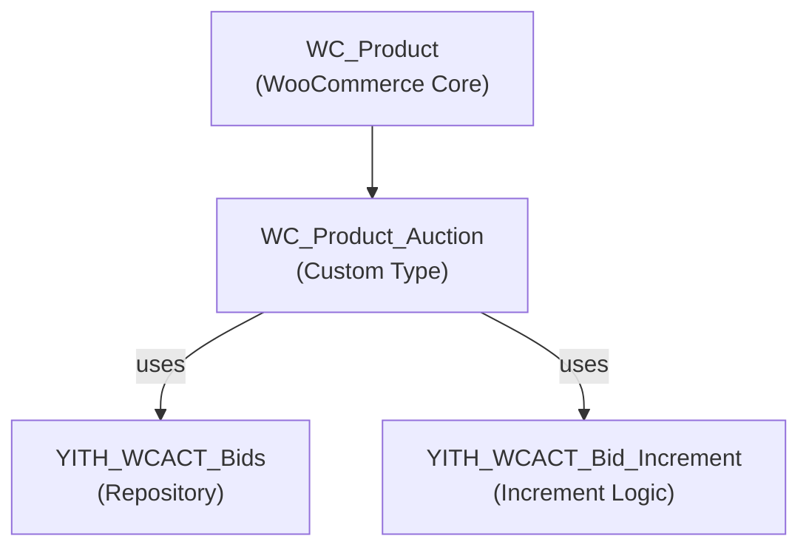

# WC_Product_Auction - Product Model Documentation

Custom WooCommerce product type managing auction-specific data, state queries, and pricing logic.

## 1. Component Overview

### Purpose/Responsibility

- **PROD-001:** Extend WooCommerce product system with auction-specific functionality
- **PROD-002:** Manage auction metadata (prices, dates, increments)
- **PROD-003:** Provide queries for auction state (active, ended, won)
- **PROD-004:** Calculate valid bid amounts based on increment rules
- **PROD-005:** Integrate seamlessly with WooCommerce product ecosystem

### Scope

**Included:**
- Auction metadata management
- Price and date validation
- Bid increment calculations
- Auction state queries
- Current bid tracking

**Excluded:**
- Bid storage (delegated to WcAuction_Bids)
- AJAX handling (delegated to WcAuction_Ajax)
- UI rendering (delegated to frontend types)

---

## 2. Architecture Section

### Design Patterns

- **Inheritance Pattern:** Extends `WC_Product` base class
- **Metadata Pattern:** Uses WordPress post metadata for field storage
- **Query Pattern:** Provides domain-specific queries
- **State Pattern:** State machine for auction lifecycle

### Class Hierarchy



### Dependencies

**Internal:**
- `YITH_WCACT_Bids` - Repository for bid records
- `YITH_WCACT_Bid_Increment` - Increment calculation logic

**External:**
- `WC_Product` - Base class from WooCommerce
- WordPress Post Types - Metadata storage
- MySQL - Persists metadata

---

## 3. Interface Documentation

### Public Methods

| Method | Purpose | Parameters | Return | Notes |
|--------|---------|-----------|---------|-------|
| `get_auction_start_price()` | Get opening bid | none | float/null | NULL if not set |
| `get_auction_reserve_price()` | Get min acceptable price | none | float/null | NULL if no reserve |
| `get_auction_start_date()` | Get auction start | none | string/null | MySQL datetime format |
| `get_auction_end_date()` | Get auction end | none | string/null | MySQL datetime format |
| `is_auction_started()` | Check if bidding active | none | bool | Current time ≥ start |
| `is_auction_ended()` | Check if auction closed | none | bool | Current time ≥ end |
| `is_auction_active()` | Check active state | none | bool | started && !ended |
| `get_current_highest_bid()` | Get winning bid amount | none | float/null | From bids repo |
| `get_current_winner()` | Get winning user | none | int/null | User ID or NULL |
| `get_auction_increment_value()` | Next valid bid increment | $current_bid (float) | float | Calculated via ranges |
| `get_auction_bids()` | Get all bids | none | array | Bid records |
| `set_auction_start_price()` | Set opening price | $price (float) | void | Updates metadata |
| `set_auction_reserve_price()` | Set min accepted price | $price (float) | void | Updates metadata |

### Metadata Structure

```php
[
    '_yith_auction_start_price'   => (string) '50.00',
    '_yith_auction_reserve_price' => (string) '100.00',
    '_yith_auction_start_date'    => (string) '2024-03-25 10:00:00',
    '_yith_auction_end_date'      => (string) '2024-04-01 22:00:00',
    '_yith_auction_bid_increments' => (string) '[...]'   // JSON
]
```

---

## 4. Implementation Details

### Metadata Persistence

Metadata stored as WooCommerce post metadata (postmeta table):

```php
// Get metadata
$start_price = $this->get_meta('_yith_auction_start_price');

// Set metadata
$this->update_meta_data('_yith_auction_start_price', $value);
$this->save_meta_data();
```

### State Machine

```
[NOT_STARTED] --now >= start_date--> [ACTIVE] --now >= end_date--> [ENDED]
     │                                    │                          │
     ├─ is_auction_started() = false      ├─ is_auction_active()     └─ is_auction_ended() = true
     └─ is_auction_active() = false       │    = true                
                                          └─ is_auction_started() = true
```

### Price Validation

```php
public function validate_auction_prices() {
    $start = floatval($this->get_auction_start_price());
    $reserve = floatval($this->get_auction_reserve_price());
    
    // Start price must be ≥ 0
    if ($start < 0) {
        throw new Exception('Start price cannot be negative');
    }
    
    // Reserve must be ≥ start (if set)
    if ($reserve > 0 && $reserve < $start) {
        throw new Exception('Reserve price cannot be less than start price');
    }
}
```

### Date Validation

```php
public function validate_auction_dates() {
    $start = strtotime($this->get_auction_start_date());
    $end = strtotime($this->get_auction_end_date());
    
    // End must be after start
    if ($end <= $start) {
        throw new Exception('End date must be after start date');
    }
    
    // End must be in future (for new auctions)
    if ($end <= time() && !$this->is_auction_ended()) {
        throw new Exception('End date must be in the future');
    }
}
```

### Bid Increment Calculation

```php
public function get_auction_increment_value($current_bid) {
    // Get increment rules for this product
    $ranges = YITH_WCACT_Bid_Increment::get_instance()
        ->get_increments_by_product($this->get_id());
    
    // Find applicable range
    foreach ($ranges as $range) {
        if ($current_bid >= $range['from_price'] && 
            ($range['to_price'] === null || $current_bid < $range['to_price'])) {
            return $range['increment'];
        }
    }
    
    // Default to $1 if no range matches
    return 1.00;
}

// Usage
$current_bid = 150.00;
$increment = $auction->get_auction_increment_value($current_bid);
$next_min = $current_bid + $increment;  // 155.00
```

### Highest Bid Retrieval

```php
public function get_current_highest_bid() {
    $bids_repo = YITH_WCACT_Bids::get_instance();
    return $bids_repo->get_highest_bid($this->get_id());
}

public function get_current_winner() {
    $bids_repo = YITH_WCACT_Bids::get_instance();
    $bid = $bids_repo->get_winning_bid($this->get_id());
    return $bid ? $bid['user_id'] : null;
}
```

---

## 5. Integration with WooCommerce

### Product Type Registration

```php
// In YITH_Auctions::init_components()
add_action('woocommerce_register_post_types', function() {
    // Register custom product type
    register_post_type('product', [
        // ... WooCommerce config
    ]);
    
    // Make 'auction' available as product type
    // Handled by WooCommerce when class exists
});
```

### Product Query Integration

```php
// Query for auction products
$args = array(
    'post_type'  => 'product',
    'meta_query' => array(
        array(
            'key' => '_yith_auction_start_price',
            'compare' => 'EXISTS'
        )
    )
);
$auctions = new WP_Query($args);
```

### Frontend Display

Product page includes:
- Start price display
- Current bid (if auction active)
- Countdown timer
- Bid history
- Bid submission form

---

## 6. State Queries Reference

### Query: Is Auction Currently Active?

```php
$product = wc_get_product($product_id);
if ($product->is_auction_active()) {
    echo "Bidding is open!";
}
```

**Logic:**
- TRUE if: current_time >= start_date AND current_time < end_date
- FALSE otherwise

### Query: Has Auction Ended?

```php
if ($product->is_auction_ended()) {
    echo "Winner: " . $product->get_current_winner();
}
```

**Logic:**
- TRUE if: current_time >= end_date
- FALSE if: current_time < end_date

### Query: Is Reserve Met?

```php
$highest_bid = $product->get_current_highest_bid();
$reserve = $product->get_auction_reserve_price();

if ($highest_bid >= $reserve) {
    echo "Reserve price met!";
}
```

---

## 7. Error Handling

### Metadata Not Found

```php
// Safe access to potentially missing metadata
public function get_auction_start_price() {
    $price = $this->get_meta('_yith_auction_start_price');
    return $price !== '' ? floatval($price) : null;
}
```

### Invalid Product Type

```php
// Ensure product is auction type
$product = wc_get_product($id);
if (!$product instanceof WC_Product_Auction) {
    throw new Exception('Product is not an auction type');
}
```

---

## 8. Performance Considerations

### Metadata Queries

- Metadata retrieved via single post meta query per product
- Cached in WooCommerce's postmeta cache
- Multiple accesses in single request reuse cache

### Bid Queries

- `get_current_highest_bid()` queries database (indexed)
- Consider caching highest bid for high-traffic auctions
- Refresh cache on every new bid

### Scalability Limit

- Supports unlimited auctions (no coordinator overhead)
- Each product independent - scales horizontally
- No N+1 queries if bid data accessed correctly

---

## 9. Testing Strategy

### Unit Tests

```php
// Test price validation
public function test_validates_start_price_required() {
    $product = new WC_Product_Auction();
    $product->set_auction_start_price(null);
    $this->expectException(Exception::class);
    $product->validate_auction_prices();
}

// Test state queries
public function test_is_auction_active_when_within_date_range() {
    $product = new WC_Product_Auction();
    $product->set_auction_start_date(date('Y-m-d H:i:s', time() - 3600));  // 1 hour ago
    $product->set_auction_end_date(date('Y-m-d H:i:s', time() + 3600));    // 1 hour future
    $this->assertTrue($product->is_auction_active());
}

// Test increment calculation
public function test_calculates_correct_increment_for_price_range() {
    // Setup ranges
    $product = new WC_Product_Auction();
    
    // Mock increment provider
    $increment = $product->get_auction_increment_value(250.00);
    $this->assertEquals(5.00, $increment);  // $100-$500 = $5 increment
}
```

---

## 10. Requirements Traceability

| Requirement | Implementation |
|-------------|-----------------|
| REQ-CORE-002: Configuration | Metadata setters/getters |
| REQ-CORE-004: Bid validation | `is_auction_active()` check |
| REQ-CORE-005: Bid increments | `get_auction_increment_value()` |
| REQ-CORE-006: History | `get_auction_bids()` returns history
| REQ-QUAL-002: Documentation | This document + PHPDoc |
