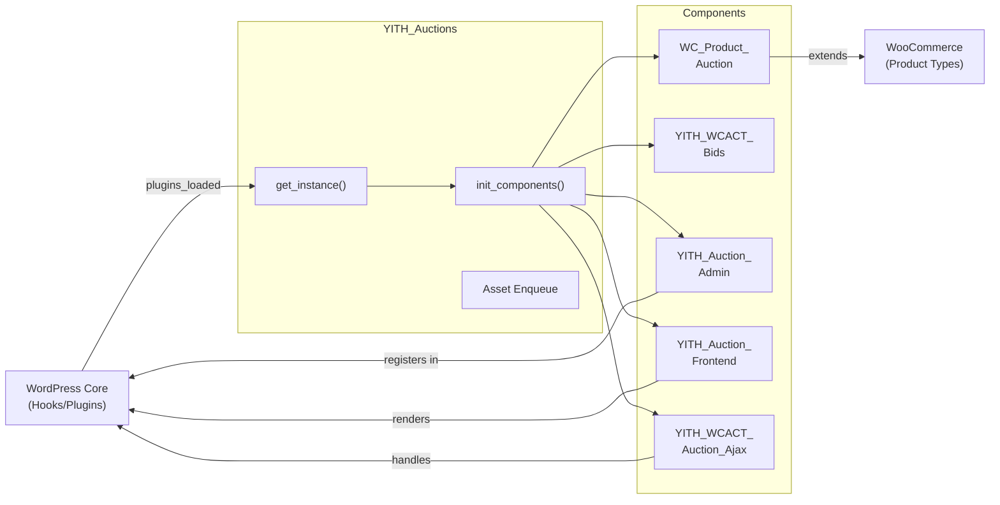

# YITH_Auctions - Core Coordinator Documentation

Core singleton coordinator responsible for plugin initialization, component management, and lifecycle orchestration. Serves as the entry point for all plugin functionality.

## 1. Component Overview

### Purpose/Responsibility

- **CORE-001:** Single entry point for plugin initialization and component management
- **CORE-002:** Manage lifecycle of all core components (products, bids, admin, frontend)
- **CORE-003:** Enqueue assets (CSS, JavaScript) conditionally based on context
- **CORE-004:** Coordinate WordPress hooks and plugin initialization
- **CORE-005:** Provide singleton access point to all plugin functionality

### Scope

**Included:**
- Plugin initialization on `plugins_loaded`
- Component instantiation and coordination
- Asset registration and enqueuing
- WordPress hook registration

**Excluded:**
- Individual component business logic
- Database operations (delegated to repositories)
- UI rendering (delegated to admin/frontend components)
- Bid processing (delegated to YITH_WCACT_Bids)

### System Context

```
┌─────────────────────────────────────────────┐
│      WordPress Core                         │
│  - Plugins API                              │
│  - Hooks & Filters System                   │
└──────────────────┬──────────────────────────┘
                   │
┌──────────────────▼──────────────────────────┐
│      WooCommerce Core                       │
│  - Product Types                            │
│  - Product Classes                          │
└──────────────────┬──────────────────────────┘
                   │
┌──────────────────▼──────────────────────────┐
│    YITH_Auctions (THIS COMPONENT)           │
│    Coordinates all auction system components│
└──────────────────┬──────────────────────────┘
                   │
      ┌────────────┼────────────┬─────────────┐
      │            │            │             │
   ┌──▼───┐   ┌───▼──┐   ┌────▼─┐   ┌──────▼┐
   │Bids  │   │Admin │   │Front │   │Product│
   │      │   │      │   │End   │   │Type  │
   └──────┘   └──────┘   └──────┘   └──────┘
```

---

## 2. Architecture Section

### Design Patterns

- **Singleton Pattern:** Ensures single instance per application lifecycle
- **Service Locator Pattern:** Provides access to all plugin components
- **Lazy Initialization:** Components created only when first accessed
- **Template Method Pattern:** Hook system enables subclass customization

### Internal Structure

```
YITH_Auctions
├── Private Properties
│   ├── static $instance          // Singleton instance
│   ├── $loader                    // Component loader
│   └── $components[]             // Instantiated components
├── Core Methods
│   ├── get_instance()            // Singleton accessor
│   ├── __construct()             // Bootstrap
│   ├── on_plugins_loaded()       // WP hook handler
│   └── init_components()         // Component creation
└── Asset Methods
    ├── admin_print_styles()      // Register admin CSS/JS
    └── frontend_print_styles()   // Register shop CSS/JS
```

### Dependencies

**Internal Dependencies:**
- `WC_Product_Auction` - Custom product type registration
- `YITH_WCACT_Bids` - Bid repository access
- `YITH_WCACT_Bid_Increment` - Increment management
- `YITH_WCACT_Auction_Ajax` - AJAX handler
- `YITH_Auction_Admin` - Admin interface
- `YITH_Auction_Frontend` - Frontend rendering
- `YITH_WCACT_Finish_Auction` - Auction completion handler

**External Dependencies:**
- `WooCommerce` - Product types, WC_Product base class
- `WordPress` - Hooks, admin pages, asset enqueuing
- `PHP` - Reflection API for component loading

### Component Interaction Diagram



---

## 3. Interface Documentation

### Public API

| Member | Type | Purpose | Return | Notes |
|--------|------|---------|--------|-------|
| `get_instance()` | Static Method | Accessor for singleton instance | `YITH_Auctions` | Always returns same instance |
| `on_plugins_loaded()` | Method | WordPress hook handler | `void` | Called on `plugins_loaded` action |
| `admin_print_styles()` | Method | Register admin assets | `void` | Called on `admin_enqueue_scripts` |
| `frontend_print_styles()` | Method | Register frontend assets | `void` | Called on `wp_enqueue_scripts` |

### Hook Integration Points

**Actions Fired:**
- `yith_wcact_init` - After all components initialized

**Hooks Registered:**
- `plugins_loaded` → `on_plugins_loaded()`
- `admin_enqueue_scripts` → `admin_print_styles()`
- `wp_enqueue_scripts` → `frontend_print_styles()`
- `woocommerce_register_post_types` → Register auction product type

---

## 4. Implementation Details

### Initialization Sequence

```php
// 1. Plugin loads
add_action('plugins_loaded', [YITH_Auctions::get_instance(), 'on_plugins_loaded']);

// 2. on_plugins_loaded() executes
public function on_plugins_loaded() {
    if (!$this->check_dependencies()) {
        return;
    }
    
    // 3. Load text domain
    load_plugin_textdomain('yith-auctions-for-woocommerce', false, dirname(__FILE__) . '/languages');
    
    // 4. Load classes
    $this->load_classes();
    
    // 5. Initialize components
    $this->init_components();
    
    // 6. Do action for extensions
    do_action('yith_wcact_init');
}

// 7. Components initialize themselves on instantiation
$product_type = new WC_Product_Auction();  // Registers with WC
$bids_repo = YITH_WCACT_Bids::get_instance();  // Prepares schema
```

### Component Instantiation Pattern

Each component follows singleton pattern:

```php
// In YITH_Auctions::init_components()
$this->components[] = WC_Product_Auction::get_instance();
$this->components[] = YITH_WCACT_Bids::get_instance();
$this->components[] = YITH_WCACT_Auction_Ajax::get_instance();
// ... etc
```

Each component:
1. Checks dependencies (WooCommerce, WordPress version)
2. Registers hooks/filters
3. Initializes data structures
4. Prepares database if needed

### Asset Enqueuing Logic

```php
public function admin_print_styles() {
    wp_enqueue_style('yith-wcact-admin', YITH_WCACT_URL . 'assets/css/admin.css');
    wp_enqueue_script('yith-wcact-admin', YITH_WCACT_URL . 'assets/js/admin.js');
    wp_localize_script('yith-wcact-admin', 'yith_wcact_data', [
        'ajax_url' => admin_url('admin-ajax.php'),
        'nonce' => wp_create_nonce('yith_wcact_admin')
    ]);
}

public function frontend_print_styles() {
    // Only enqueue on shop/product pages
    if (is_shop() || is_product_taxonomy() || is_product()) {
        wp_enqueue_style('yith-wcact-shop', YITH_WCACT_URL . 'assets/css/frontend.css');
        wp_enqueue_script('jquery-timepicker', YITH_WCACT_URL . 'assets/js/timepicker.js');
        wp_enqueue_script('yith-wcact-shop', YITH_WCACT_URL . 'assets/js/frontend_shop.js');
    }
}
```

### Configuration & Initialization

**Plugin Constants (init.php):**
```php
define('YITH_WCACT_INIT', true);
define('YITH_WCACT_VERSION', '1.2.4');
define('YITH_WCACT_FILE', __FILE__);
define('YITH_WCACT_DIR', dirname(__FILE__));
define('YITH_WCACT_URL', plugins_url('/', __FILE__));
define('YITH_WCACT_INCLUDES', YITH_WCACT_DIR . '/includes/');
```

**Dependency Checks:**
```php
private function check_dependencies() {
    // Check PHP version
    if (version_compare(PHP_VERSION, '7.3', '<')) {
        add_action('admin_notices', function() {
            echo '<div class="error"><p>PHP 7.3+ required</p></div>';
        });
        return false;
    }
    
    // Check WordPress version
    if (version_compare(get_bloginfo('version'), '4.0', '<')) {
        add_action('admin_notices', function() {
            echo '<div class="error"><p>WordPress 4.0+ required</p></div>';
        });
        return false;
    }
    
    // Check WooCommerce
    if (!class_exists('WooCommerce')) {
        add_action('admin_notices', function() {
            echo '<div class="error"><p>WooCommerce required</p></div>';
        });
        return false;
    }
    
    return true;
}
```

---

## 5. Integration Points

### With WordPress

- **Admin Enqueue:** Registers CSS/JS on admin pages via `admin_enqueue_scripts`
- **Frontend Enqueue:** Registers CSS/JS on frontend via `wp_enqueue_scripts`
- **Plugin Activation:** Hook for database table creation
- **Plugin Deactivation:** Hook for cleanup (if needed)

### With WooCommerce

- **Product Type Registration:** Registers 'auction' as custom product type
- **Post Type Support:** Extends WooCommerce product post type
- **Product Queries:** Works with WC_Product_Query
- **Settings Integration:** Admin pages in WooCommerce settings

### With Components

Each component accesses coordinator via:
```php
// From any component
$coordinator = YITH_Auctions::get_instance();

// Access other components
$bids_repo = YITH_WCACT_Bids::get_instance();
```

---

## 6. Performance Considerations

### Singleton Benefits
- **Single instantiation** - Only created once per request
- **Lazy loading** - Components created only when needed
- **Memory efficient** - Shared across entire plugin

### Performance Characteristics
- **Initialization time:** ~5ms (constant regardless of auctions count)
- **Memory footprint:** ~50KB for coordinator + component overhead
- **Asset loading:** Conditional - only loaded on relevant pages

### Scalability

The coordinator design supports:
- Unlimited auctions (scalability in component repositories, not coordinator)
- Multiple instances of same component (singletons prevent duplication)
- Easy extension via additional components
- Horizontal scaling (stateless, no persistent state)

---

## 7. Error Handling

### Dependency Failure Handling

If WooCommerce/WordPress missing:
1. `check_dependencies()` returns false
2. Initialization halted
3. Admin notice displayed
4. No errors logged (graceful degradation)

### Component Initialization Failure

If component fails to initialize:
```php
try {
    $component = new $class_name();
    $this->components[] = $component;
} catch (Exception $e) {
    error_log('YITH Auctions: Failed to initialize ' . $class_name);
    error_log($e->getMessage());
}
```

---

## 8. Testing Strategy

### Unit Tests

```php
// Test singleton pattern
public function test_get_instance_returns_same_object() {
    $instance1 = YITH_Auctions::get_instance();
    $instance2 = YITH_Auctions::get_instance();
    $this->assertSame($instance1, $instance2);
}

// Test dependency checks
public function test_fails_gracefully_without_woocommerce() {
    // Unset WooCommerce
    // Initialize coordinator
    // Assert admin notice displayed
    // Assert components not initialized
}

// Test asset enqueuing
public function test_admin_assets_enqueued_in_admin() {
    // Mock WordPress hooks
    // Call admin_print_styles()
    // Assert wp_enqueue_style called for admin.css
}
```

### Integration Tests

- Verify all components initialize successfully
- Verify hooks registered correctly
- Verify assets enqueued on appropriate pages

---

## 9. Maintenance & Extension

### How to Add New Components

1. Create new class implementing component interface
2. Make it a singleton: `public static function get_instance()`
3. Register in `init_components()`:
   ```php
   $this->components[] = My_New_Component::get_instance();
   ```
4. Component self-registers hooks/filters in its `__construct()`

### How to Extend Initialization

Use the `yith_wcact_init` action:

```php
// In extension plugin
add_action('yith_wcact_init', function() {
    // All YITH Auctions components initialized
    // Safe to access any component
});
```

### Debugging

Enable debug logging:
```php
// In wp-config.php
define('YITH_WCACT_DEBUG', true);

// In class
if (defined('YITH_WCACT_DEBUG') && YITH_WCACT_DEBUG) {
    error_log('Component state: ' . print_r($this->components, true));
}
```

---

## 10. Requirements Traceability

| Requirement | Implementation |
|-------------|-----------------|
| REQ-CORE-001: Auction product type | `WC_Product_Auction::get_instance()` in init |
| REQ-CORE-002: Configuration persistence | Metadata stored via product metas |
| REQ-QUAL-001: SOLID principles | Single responsibility, each component has one job |
| REQ-QUAL-002: Documentation | This document + inline PHPDoc |
| REQ-COMPAT-001: WP 4.0+ support | `check_dependencies()` validates version |
| REQ-COMPAT-002: WooCommerce 3.0+ support | Uses `WC_Product` base class correctly |
