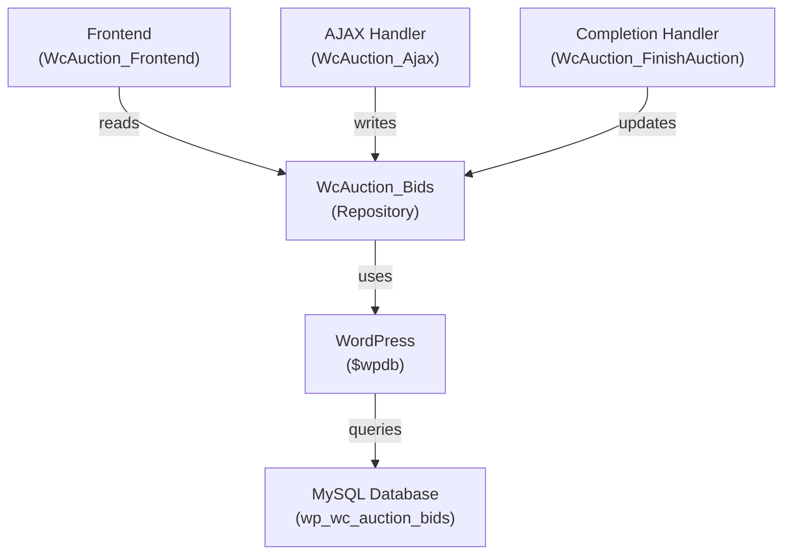

# WcAuction_Bids - Data Repository Documentation

Data access layer providing persistent bid storage, querying, and status management through the Active Record pattern.

## 1. Component Overview

### Purpose/Responsibility

- **DATA-001:** Persist bid records to database table
- **DATA-002:** Query bids by auction, user, or bid ID
- **DATA-003:** Update bid status (pending → winner/outbid)
- **DATA-004:** Calculate highest bid for auctions
- **DATA-005:** Maintain immutable append-only bid history

### Scope

**Included:**
- CREATE operations (insert new bids)
- READ operations (query bid records)
- UPDATE operations (status changes only)
- Database schema management
- Index management

**Excluded:**
- Bid validation (delegated to WcAuction_Ajax)
- Business logic (delegated to product model)
- UI rendering (delegated to frontend)

---

## 2. Architecture Section

### Design Patterns

- **Repository Pattern:** Abstracts database operations
- **Active Record Pattern:** Objects encapsulate database access
- **Singleton Pattern:** Single instance per request lifecycle
- **Value Object Pattern:** Bid records immutable after creation

### Dependencies



---

## 3. Interface Documentation

### Core Methods

| Method | Purpose | Parameters | Return | Notes |
|--------|---------|-----------|---------|-------|
| `add_bid()` | Create bid record | $auction_id, $user_id, $bid_amount | int (bid_id) | Immutable creation |
| `get_auction_bids()` | Query auction's bids | $auction_id, $order='DESC', $limit=null | array | Sorted newest first |
| `get_user_bids()` | Query user's bids | $user_id, $status=null, $limit=null | array | User's complete history |
| `get_highest_bid()` | Get winning amount | $auction_id | float/null | NULL if no bids |
| `get_winning_bid()` | Get winner record | $auction_id | array/null | Full bid object |
| `get_bid()` | Get specific bid | $bid_id | array/null | By bid ID |
| `update_bid_status()` | Change status | $bid_id, $status | bool | winner\|outbid\|pending\|expired |
| `get_bid_count()` | Count auction bids | $auction_id | int | Total bids on product |
| `get_user_win_count()` | Count user's wins | $user_id | int | Auctions user won |
| `ensure_table_exists()` | Create/verify schema | none | void | Idempotent creation |

---

## 4. Implementation Details

### Database Schema

**Table: `wp_WcAuction_auction`**

```sql
CREATE TABLE wp_WcAuction_auction (
    id BIGINT UNSIGNED PRIMARY KEY AUTO_INCREMENT,
    auction_id BIGINT UNSIGNED NOT NULL COMMENT 'Product ID',
    user_id BIGINT UNSIGNED NOT NULL COMMENT 'User ID',
    bid DECIMAL(10,2) UNSIGNED NOT NULL COMMENT 'Bid amount',
    timestamp DATETIME NOT NULL DEFAULT CURRENT_TIMESTAMP COMMENT 'Submission time',
    status VARCHAR(50) NOT NULL DEFAULT 'pending' COMMENT 'bid status',
    
    KEY idx_auction_time (auction_id, timestamp DESC),
    KEY idx_user_time (user_id, timestamp DESC),
    KEY idx_auction_bid (auction_id, bid DESC),
    KEY idx_status (status)
) ENGINE=InnoDB DEFAULT CHARSET=utf8mb4 COLLATE=utf8mb4_unicode_ci;
```

### Index Strategy

| Index | Purpose | Query Pattern |
|-------|---------|---------------|
| `(auction_id, timestamp DESC)` | Get all bids for auction | `get_auction_bids()` |
| `(user_id, timestamp DESC)` | Get user's bid history | `get_user_bids()` |
| `(auction_id, bid DESC)` | Find highest bid | `get_highest_bid()` |
| `(status)` | Filter by outcome | Status updates |

### Table Creation (Idempotent)

```php
public function ensure_table_exists() {
    global $wpdb;
    
    $table_name = $wpdb->prefix . 'WcAuction_auction';
    
    if ($wpdb->get_var("SHOW TABLES LIKE '$table_name'") == $table_name) {
        return;  // Table exists
    }
    
    // Create table
    $sql = "CREATE TABLE $table_name (
        id BIGINT UNSIGNED PRIMARY KEY AUTO_INCREMENT,
        auction_id BIGINT UNSIGNED NOT NULL,
        user_id BIGINT UNSIGNED NOT NULL,
        bid DECIMAL(10,2) UNSIGNED NOT NULL,
        timestamp DATETIME NOT NULL DEFAULT CURRENT_TIMESTAMP,
        status VARCHAR(50) NOT NULL DEFAULT 'pending',
        KEY idx_auction_time (auction_id, timestamp DESC),
        KEY idx_user_time (user_id, timestamp DESC),
        KEY idx_auction_bid (auction_id, bid DESC)
    ) ENGINE=InnoDB DEFAULT CHARSET=utf8mb4 COLLATE=utf8mb4_unicode_ci";
    
    require_once(ABSPATH . 'wp-admin/includes/upgrade.php');
    dbDelta($sql);
}
```

### Insert Operation (Append-Only)

```php
public function add_bid($auction_id, $user_id, $bid_amount) {
    global $wpdb;
    
    $table = $wpdb->prefix . 'WcAuction_auction';
    
    // Parameterized query prevents SQL injection
    $result = $wpdb->insert(
        $table,
        [
            'auction_id' => intval($auction_id),
            'user_id' => intval($user_id),
            'bid' => floatval($bid_amount),
            'timestamp' => current_time('mysql'),
            'status' => 'pending'
        ],
        ['%d', '%d', '%f', '%s', '%s']
    );
    
    if (!$result) {
        throw new Exception("Failed to insert bid: " . $wpdb->last_error);
    }
    
    return $wpdb->insert_id;
}
```

### Query Operations

```php
// Get all bids for auction
public function get_auction_bids($auction_id, $order = 'DESC', $limit = null) {
    global $wpdb;
    
    $table = $wpdb->prefix . 'WcAuction_auction';
    $query = $wpdb->prepare(
        "SELECT * FROM $table 
         WHERE auction_id = %d 
         ORDER BY timestamp $order",
        $auction_id
    );
    
    if ($limit) {
        $query .= $wpdb->prepare(" LIMIT %d", $limit);
    }
    
    return $wpdb->get_results($query, ARRAY_A);
}

// Get highest bid using index
public function get_highest_bid($auction_id) {
    global $wpdb;
    
    $table = $wpdb->prefix . 'WcAuction_auction';
    return $wpdb->get_var($wpdb->prepare(
        "SELECT MAX(bid) FROM $table WHERE auction_id = %d",
        $auction_id
    ));
}

// Get winning bid record
public function get_winning_bid($auction_id) {
    global $wpdb;
    
    $table = $wpdb->prefix . 'WcAuction_auction';
    return $wpdb->get_row($wpdb->prepare(
        "SELECT * FROM $table 
         WHERE auction_id = %d AND status = 'winner' 
         LIMIT 1",
        $auction_id
    ), ARRAY_A);
}
```

### Status Update Operations

```php
// Update bid status (only status can be updated)
public function update_bid_status($bid_id, $new_status) {
    global $wpdb;
    
    $valid_statuses = ['pending', 'winner', 'outbid', 'expired'];
    
    if (!in_array($new_status, $valid_statuses)) {
        throw new Exception("Invalid status: $new_status");
    }
    
    $table = $wpdb->prefix . 'WcAuction_auction';
    $result = $wpdb->update(
        $table,
        ['status' => $new_status],
        ['id' => $bid_id],
        ['%s'],
        ['%d']
    );
    
    return $result !== false;
}

// Bulk update all outbid bids for auction
public function update_all_previous_bids_to_outbid($auction_id) {
    global $wpdb;
    
    $table = $wpdb->prefix . 'WcAuction_auction';
    $wpdb->query($wpdb->prepare(
        "UPDATE $table 
         SET status = 'outbid' 
         WHERE auction_id = %d AND status = 'pending'",
        $auction_id
    ));
}
```

---

## 5. Bid Lifecycle

### State Transitions

```
[PENDING] ──bid_is_highest──> [WINNER]
   ↓                             ↑
   └──newer_higher_bid_submitted─┘
         [OUTBID]

[PENDING] ──auction_ends──> [EXPIRED] (if not winner)
```

### Example Lifecycle

```
1. User submits bid($100) for auction
   → create record with status='pending'

2. User submits higher bid($200)
   → create new record with status='pending'
   → update previous bid: status='outbid'

3. Another user submits bid($250)
   → create new record with status='pending'
   → update previous: status='outbid'

4. Auction ends
   → update highest bid: status='winner'
   → ensure all others: status='outbid'
```

---

## 6. Query Performance

### Optimization Examples

**GOOD - Uses index:**
```php
// Query uses (auction_id, timestamp) index
$bids = $this->get_auction_bids($auction_id);  // ~2ms
```

**GOOD - Uses index:**
```php
// Query uses (user_id, timestamp) index
$user_bids = $this->get_user_bids($user_id);   // ~5ms
```

**GOOD - Uses index:**
```php
// Query uses (auction_id, bid) index
$max_bid = $this->get_highest_bid($auction_id);  // ~1ms
```

**AVOID - Full table scan:**
```php
// No index for this pattern
$bids = $wpdb->get_results(
    "SELECT * FROM table WHERE bid > 100"  // SLOW!
);
```

### Scaling Characteristics

- **1,000 bids per auction:** Response time remains <5ms
- **1,000,000 total bids:** No performance degradation (indexed)
- **Daily 10,000 bids** High-volume auctions: Indexes essential

---

## 7. Error Handling & Validation

### Bid Insertion Failures

```php
try {
    $bid_id = $this->add_bid($auction_id, $user_id, $bid_amount);
} catch (Exception $e) {
    error_log("Bid insertion failed: " . $e->getMessage());
    http_response_code(500);
    wp_send_json_error("System error. Please try again.");
}
```

### Query Failures

```php
$bids = $this->get_auction_bids($auction_id);

if ($bids === null) {
    // Query failed
    error_log("Failed to retrieve bids for auction $auction_id");
    return [];
}
```

---

## 8. Testing Strategy

### Unit Tests

```php
// Test bid insertion
public function test_inserts_bid_and_returns_id() {
    $bid_id = $this->repo->add_bid(123, 456, 150.00);
    $this->assertIsInt($bid_id);
    $this->assertGreaterThan(0, $bid_id);
}

// Test bid retrieval
public function test_retrieves_auction_bids_in_descending_order() {
    // Insert multiple bids
    $this->repo->add_bid(123, 1, 100.00);
    sleep(0.1);
    $this->repo->add_bid(123, 2, 150.00);
    
    $bids = $this->repo->get_auction_bids(123);
    $this->assertEquals(150.00, $bids[0]['bid']);  // Newest first
    $this->assertEquals(100.00, $bids[1]['bid']);
}

// Test status update
public function test_updates_bid_status() {
    $bid_id = $this->repo->add_bid(123, 456, 150.00);
    $this->repo->update_bid_status($bid_id, 'winner');
    
    $bid = $this->repo->get_bid($bid_id);
    $this->assertEquals('winner', $bid['status']);
}
```

### Integration Tests

```php
// Test complete auction lifecycle
public function test_auction_completion_workflow() {
    // Simulate multiple bids
    $bid1 = $this->repo->add_bid(123, 1, 100.00);
    $bid2 = $this->repo->add_bid(123, 2, 150.00);
    $bid3 = $this->repo->add_bid(123, 2, 200.00);
    
    // Completion handler updates statuses
    $this->repo->update_all_previous_bids_to_outbid(123);
    $this->repo->update_bid_status($bid3, 'winner');
    
    // Verify final state
    $winner = $this->repo->get_winning_bid(123);
    $this->assertEquals($bid3, $winner['id']);
    $this->assertEquals(2, $winner['user_id']);
    $this->assertEquals(200.00, $winner['bid']);
}
```

---

## 9. Requirements Traceability

| Requirement | Implementation |
|-------------|-----------------|
| REQ-CORE-003: Bid submission | `add_bid()` persists |
| REQ-CORE-006: Bid history | `get_auction_bids()` retrieves |
| REQ-CORE-007: Completion | `update_bid_status()` marks winner |
| REQ-SECURITY-003: Data integrity | INSERT append-only, UPDATE on status |
| REQ-SECURITY-004: SQL injection | All queries use `$wpdb->prepare()` |
| REQ-PERF-002: DB optimization | Indexes on all query patterns |
| REQ-QUAL-002: Documentation | This document |
