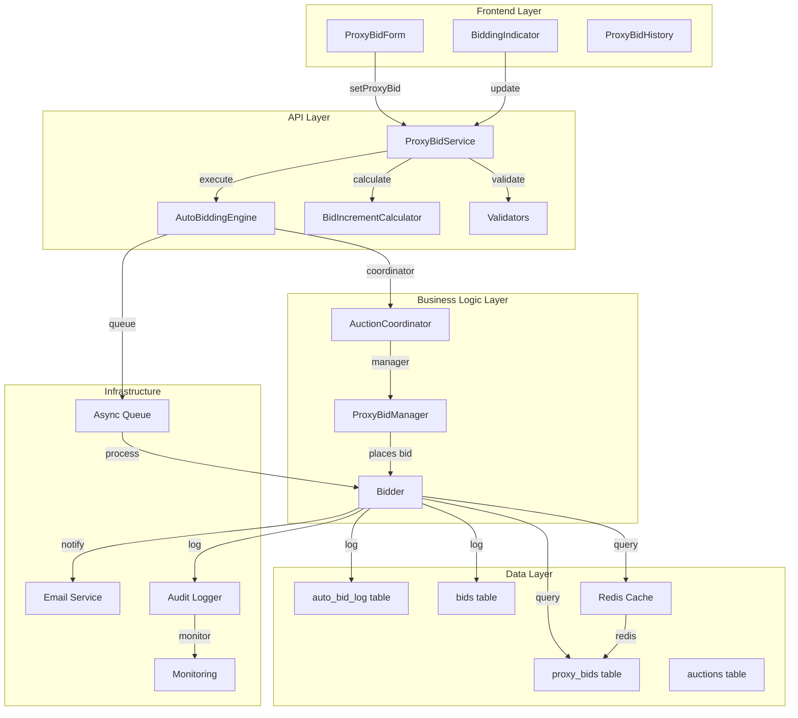

# Auto-Bidding Implementation Plan

**Version:** 1.0 | **Status:** Planning | **Estimated Effort:** 32-40 hours | **Target Release:** v1.4.0 Q2 2026

---

## Goal

Implement a complete proxy bidding system that automatically places bids on behalf of users who have set a maximum bid amount. The system must handle concurrent bidding scenarios, maintain data integrity, provide comprehensive audit trails, and deliver sub-100ms performance for bid processing decisions. This enables users to participate in auctions passively while maximizing their chances of winning with optimal bid increments.

---

## Phase Overview & Timeline

### Phase 1: Database & Data Model (8-10 hours)
- [ ] Design proxy bid data model and schema
- [ ] Create database migrations
- [ ] Design auction bid extensions  
- [ ] Implement indexes and constraints
- [ ] Write unit tests for model persistence

### Phase 2: Core Service Implementation (12-16 hours)
- [ ] Implement ProxyBidService (lifecycle management)
- [ ] Implement AutoBiddingEngine (core logic)
- [ ] Implement BidIncrementCalculator (increment logic)
- [ ] Write unit tests (100% coverage)
- [ ] Implement audit logging

### Phase 3: Frontend Components (6-8 hours)
- [ ] Create ProxyBidForm component
- [ ] Create BiddingIndicator component  
- [ ] Create ProxyBidHistory component
- [ ] Implement form validation
- [ ] Write component tests

### Phase 4: Integration & Async Processing (4-6 hours)
- [ ] Integrate auto-bidding into main bidding flow
- [ ] Implement async queue for processing
- [ ] Create error handling & retry logic
- [ ] Performance optimization & caching

### Phase 5: Testing & Polish (2-4 hours)
- [ ] End-to-end testing
- [ ] Load/performance testing
- [ ] Security audit
- [ ] Documentation & release prep

---

## Requirements

### Core Requirements

| ID | Requirement | Priority | Status |
|----|-------------|----------|--------|
| R1 | Users can set proxy bid max on active auctions | Critical | Backlog |
| R2 | System auto-bids when user is outbid | Critical | Backlog |
| R3 | Auto-bids respect bid increment rules | Critical | Backlog |
| R4 | Auto-bid processing < 100ms | Critical | Backlog |
| R5 | 99.9% auto-bid success rate | Critical | Backlog |
| R6 | Complete audit trail of all bids | Critical | Backlog |
| R7 | Users notified when outbid | High | Backlog |
| R8 | Proxy bid max never exceeded | Critical | Backlog |
| R9 | Thread-safe bid processing | Critical | Backlog |
| R10 | Configurable bid increment tables | High | Backlog |

---

## Technical Considerations

### System Architecture Overview



**Layer Responsibilities:**

1. **Frontend**: User input, form validation, status display
2. **API**: Request routing, authentication, response formatting
3. **Business Logic**: Rules enforcement, workflow coordination
4. **Data**: Persistence, queries, caching
5. **Infrastructure**: Async processing, notifications, monitoring

---

### Database Schema Design

#### Table: wp_wc_auction_proxy_bids

```sql
CREATE TABLE wp_wc_auction_proxy_bids (
    id BIGINT PRIMARY KEY AUTO_INCREMENT,
    auction_id BIGINT NOT NULL,
    user_id BIGINT NOT NULL,
    maximum_bid DECIMAL(10,2) NOT NULL,
    current_proxy_bid DECIMAL(10,2),
    status ENUM('active', 'ended', 'cancelled', 'outbid') DEFAULT 'active',
    created_at TIMESTAMP DEFAULT CURRENT_TIMESTAMP,
    updated_at TIMESTAMP DEFAULT CURRENT_TIMESTAMP ON UPDATE CURRENT_TIMESTAMP,
    ended_at TIMESTAMP NULL,
    cancelled_at TIMESTAMP NULL,
    cancelled_by_user BOOLEAN DEFAULT FALSE,
    notes VARCHAR(255),
    
    UNIQUE KEY uk_auction_user (auction_id, user_id),
    KEY idx_user_status (user_id, status),
    KEY idx_auction_status (auction_id, status),
    KEY idx_created_at (created_at),
    FOREIGN KEY fk_auction (auction_id) REFERENCES wp_wc_auction_items(ID),
    FOREIGN KEY fk_user (user_id) REFERENCES wp_users(ID)
);
```

**Indexes:**
- `uk_auction_user`: Prevent duplicate proxies per user per auction
- `idx_user_status`: Quick lookup of user's active proxies
- `idx_auction_status`: Find all active proxies for an auction
- `idx_created_at`: Timeline queries

**Rationale:**
- ENUM for status keeps data normalized and queryable
- Separate `maximum_bid` and `current_proxy_bid` distinguish user's max from current committed bid
- Timestamps track lifecycle (created, updated, ended, cancelled)
- Foreign keys ensure referential integrity

---

#### Table: wp_wc_auction_auto_bid_log

```sql
CREATE TABLE wp_wc_auction_auto_bid_log (
    id BIGINT PRIMARY KEY AUTO_INCREMENT,
    auction_id BIGINT NOT NULL,
    user_id BIGINT NOT NULL,
    proxy_bid_id BIGINT NOT NULL,
    bid_amount DECIMAL(10,2) NOT NULL,
    previous_bid DECIMAL(10,2),
    bid_increment_used DECIMAL(10,2),
    outbidding_bid_id BIGINT NULL,
    success BOOLEAN DEFAULT TRUE,
    error_message VARCHAR(500),
    processing_time_ms INT,
    triggered_at TIMESTAMP DEFAULT CURRENT_TIMESTAMP,
    
    KEY idx_auction (auction_id),
    KEY idx_user (user_id),
    KEY idx_proxy (proxy_bid_id),
    KEY idx_triggered (triggered_at),
    KEY idx_success (success),
    FOREIGN KEY fk_auction (auction_id) REFERENCES wp_wc_auction_items(ID),
    FOREIGN KEY fk_user (user_id) REFERENCES wp_users(ID),
    FOREIGN KEY fk_proxy (proxy_bid_id) REFERENCES wp_wc_auction_proxy_bids(id),
    FOREIGN KEY fk_outbid (outbidding_bid_id) REFERENCES wp_wc_auction_bids(id)
);
```

**Rationale:**
- Immutable log of every auto-bid attempt (success or failure)
- Tracks pre/post state for debugging and auditing
- `processing_time_ms` enables performance monitoring
- Links to triggering bid for complete audit trail
- Allows reconstruction of auction state at any point in time

---

#### Table Modifications: wp_wc_auction_bids

```sql
ALTER TABLE wp_wc_auction_bids ADD COLUMN (
    is_auto_bid BOOLEAN DEFAULT FALSE,
    triggered_by_bid_id BIGINT NULL,
    proxy_bid_id BIGINT NULL
);

ALTER TABLE wp_wc_auction_bids ADD KEY idx_auto_bid (is_auto_bid);
ALTER TABLE wp_wc_auction_bids ADD FOREIGN KEY fk_proxy (proxy_bid_id) REFERENCES wp_wc_auction_proxy_bids(id);
```

**Rationale:**
- Distinguish auto-bids from manual bids in audit
- Link back to triggering bid and proxy for full traceability
- Enables filtering of historical data

---

**Migration Strategy:**

1. Create new tables in staging environment
2. Test schema with 1M+ row dataset
3. Run migrations on production database (non-blocking, no lock required)
4. Populate historical test data
5. Validate indexes perform correctly
6. Monitor query performance for 48 hours post-migration

---

### Core Service Architecture

#### Service: ProxyBidService

**Responsibility:** Manage proxy bid lifecycle (create, read, update, delete)

```php
class ProxyBidService {
    private $proxyBidRepository;
    private $auctionRepository;
    private $autoBiddingEngine;
    private $bidIncrementCalculator;
    private $logger;
    private $cache;
    
    // -- Proxy Bid Lifecycle --
    public function setProxyBid(int $auctionId, int $userId, float $maxBid): ProxyBid
    public function updateProxyBid(int $proxyBidId, float $newMaxBid): ProxyBid
    public function cancelProxyBid(int $proxyBidId): bool
    public function getProxyBid(int $proxyBidId): ProxyBid
    public function getUserProxyBids(int $userId): ProxyBid[]
    public function getAuctionProxyBids(int $auctionId): ProxyBid[]
    
    // -- Validation & Business Rules --
    public function validateProxyBidInput(int $auctionId, float $maxBid): ValidationResult
    public function canSetProxyBid(int $auctionId, int $userId): bool
    public function getProxyBidRequirements(int $auctionId): ProxyBidRequirements
    
    // -- Queries for Auto-Bidding --
    public function getOutstandingProxyBidsForAuction(int $auctionId): ProxyBid[]
    public function getUserProxyBidForAuction(int $auctionId, int $userId): ?ProxyBid
}
```

**Key Methods Detailed:**

```php
public function setProxyBid(int $auctionId, int $userId, float $maxBid): ProxyBid {
    // 1. Validate auction exists and is active
    $auction = $this->auctionRepository->find($auctionId);
    if (!$auction || !$auction->isActive()) {
        throw new AuctionException('Auction not active');
    }
    
    // 2. Check for existing proxy bid
    $existing = $this->proxyBidRepository->findByAuctionAndUser($auctionId, $userId);
    if ($existing) {
        throw new DuplicateProxyBidException('User already has proxy bid for this auction');
    }
    
    // 3. Validate max bid amount
    $requirements = $this->getProxyBidRequirements($auctionId);
    $validation = $this->validateProxyBidInput($auctionId, $maxBid);
    if (!$validation->isValid()) {
        throw new ValidationException($validation->getErrors());
    }
    
    // 4. Create proxy bid (starts at current bid + increment)
    $currentBid = $auction->getCurrentBid();
    $increment = $this->bidIncrementCalculator->getIncrement($currentBid);
    $initialBid = $currentBid + $increment;
    
    $proxyBid = ProxyBid::create(
        $auctionId,
        $userId,
        $maxBid,
        $initialBid
    );
    
    // 5. Save to database + cache
    $this->proxyBidRepository->save($proxyBid);
    $this->cache->set('proxy_bid:' . $proxyBid->getId(), $proxyBid, 3600);
    
    // 6. Log creation
    $this->logger->info('Proxy bid created', [
        'proxy_bid_id' => $proxyBid->getId(),
        'auction_id' => $auctionId,
        'user_id' => $userId,
        'max_bid' => $maxBid
    ]);
    
    // 7. Trigger any immediate auto-bidding if needed
    $this->autoBiddingEngine->processAuction($auctionId);
    
    return $proxyBid;
}
```

---

#### Service: AutoBiddingEngine

**Responsibility:** Execute auto-bidding logic and place bids

```php
class AutoBiddingEngine {
    private $proxyBidService;
    private $bidRepository;
    private $bidIncrementCalculator;
    private $transactionManager;
    private $queue;
    private $logger;
    
    // -- Core Entry Points --
    public function processNewBid(Bid $newBid): void
    public function processAuction(int $auctionId): void
    public function retryFailedAutoBids(int $minAgeMinutes = 5): void
    
    // -- Internal Logic --
    private function determinAutoBidRequired(int $auctionId): ?int // returns user ID
    private function calculateNextBidAmount(ProxyBid $proxy, float $outbiddingAmount): float
    private function placeAutoBid(ProxyBid $proxy, float $bidAmount): Bid
    private function recordAutoBidAttempt(ProxyBid $proxy, float $amount, bool $success, ?string $error): void
}
```

**Key Algorithm - determinAutoBidRequired:**

```
Function: determineAutoBidRequired(auctionId)

1. Get current highest bid from auction
   highestBid = getAuctionCurrentBid(auctionId)
   highestBidder = getHighestBidder(auctionId)

2. Get all active proxy bids for this auction
   proxies = getAuctionProxyBids(auctionId) where status='active'

3. Find proxy bids that could beat current highest
   validProxies = []
   for each proxy in proxies:
       if proxy.user != highestBidder AND proxy.maximum > highestBid:
           validProxies.append(proxy)

4. If no valid proxies, return null (no auto-bid needed)
   if validProxies is empty:
       return null

5. Find highest-maximum proxy (ties broken by earliest created)
   highestProxy = max(validProxies) by maximum_bid, then by created_at
   
6. Verify highest proxy would beat current bid
   nextIncrement = calculateIncrement(highestBid)
   proposedBid = highestBid + nextIncrement
   
   if proposedBid > highestProxy.maximum:
       return null  // proxy max too low
   else:
       return highestProxy.user_id

```

**Performance Optimizations:**

1. **Caching**: Cache current auction bid state (invalidated on each new bid)
2. **Batch Processing**: Queue auto-bids async to avoid blocking main bid flow
3. **Index Strategy**: 
   - `(auction_id, status, maximum_bid)` for fast proxy lookup
   - `(auction_id, created_at)` for tie-breaking
4. **Lazy Evaluation**: Only process proxies that could realistically win

---

#### Service: BidIncrementCalculator

**Responsibility:** Determine valid bid increments based on auction configuration

```php
class BidIncrementCalculator {
    private $auctionRepository;
    private $cache;
    
    public function getIncrement(float $currentBid, ?int $auctionId = null): float
    public function getIncrementTable(?int $auctionId = null): BidIncrementTable
    public function getNextValidBid(float $currentBid, ?int $auctionId = null): float
    public function validateBidAmount(float $bid, float $previousBid): bool
}
```

**Default Increment Table (Customizable per Auction):**

| Bid Range | Increment |
|-----------|-----------|
| $0 - $50 | $1 |
| $50 - $100 | $5 |
| $100 - $500 | $10 |
| $500 - $1,000 | $25 |
| $1,000 - $2,500 | $50 |
| $2,500 - $5,000 | $100 |
| $5,000+ | $250 |

**Implementation:**

```php
public function getIncrement(float $currentBid, ?int $auctionId = null): float {
    // Get increment table for auction (or default)
    $table = $this->getIncrementTable($auctionId);
    
    // Find matching range
    foreach ($table->getRanges() as $range) {
        if ($currentBid >= $range->getMinBid() && $currentBid < $range->getMaxBid()) {
            return $range->getIncrement();
        }
    }
    
    // Default for amounts above table
    return $table->getDefaultIncrement();
}
```

---

### Frontend Component Architecture

#### Component: ProxyBidForm

**Props:**
```tsx
interface ProxyBidFormProps {
  auctionId: number;
  currentBid: number;
  minimumNextBid: number;
  userMaxBid?: number;  // If editing existing
  onSubmit: (maxBid: number) => Promise<void>;
  onCancel: () => void;
}
```

**State Management:**
```tsx
interface ProxyBidFormState {
  formValue: string;
  isSubmitting: boolean;
  error: string | null;
  success: boolean;
}
```

**Validation:**
- User input must be numeric
- Must be >= minimumNextBid
- Must be <= site's maximum proxy bid cap (9,999)
- Server-side validation on submit

**User Flow:**
1. User clicks "Set Maximum Bid"
2. Form appears with current bid and next increment pre-filled
3. User enters their maximum
4. On submit: validate, send API request, show loading
5. On success: show confirmation, close form
6. On error: display error message with retry option

---

#### Component: BiddingIndicator

**Shows real-time proxy bid status:**

```tsx
interface BiddingIndicatorProps {
  proxyBid: ProxyBid | null;
  currentBid: Bid;
  isUpdating: boolean;
}

// Renders:
// If no proxy: [Set Maximum Bid button]
// If proxy active: "Proxy Bid: $X (You bid $Y via auto-bid)"
// If proxy exhausted: "At Your Maximum ($X) - Outbid"
```

**Refresh Strategy:**
- Poll auction state every 5 seconds
- WebSocket subscription for real-time updates (optional, Phase 2)
- Optimistic UI updates for user actions

---

### API Endpoints

#### POST /auctions/{id}/proxy-bid

**Request:**
```json
{
  "maximum_bid": 250.00
}
```

**Response (201):**
```json
{
  "id": 123,
  "auction_id": 456,
  "maximum_bid": 250.00,
  "current_proxy_bid": 55.00,
  "status": "active",
  "created_at": "2026-03-22T10:30:00Z"
}
```

**Errors:**
- 400: Invalid input (not numeric, below minimum, etc.)
- 401: Not authenticated
- 403: Not allowed (auction over, etc.)
- 409: Conflict (proxy already exists for this user)
- 500: Server error

---

#### PUT /proxy-bids/{id}

**Request:**
```json
{
  "maximum_bid": 300.00
}
```

**Response (200):** Updated proxy bid

---

#### DELETE /proxy-bids/{id}

**Response (204):** No content (success)

---

#### GET /auctions/{id}/proxy-bid

**Returns:** Current user's proxy bid for this auction (or null)

---

### Performance & Scaling

**Target Metrics:**
- Auto-bid processing: < 100ms
- Auto-bid throughput: 1,000 bids/second
- Concurrent auctions with proxies: 1,000+
- Active proxy bids: 10,000+

**Optimizations:**

1. **Database:**
   - Index on `(auction_id, status)`
   - Batch proxy lookups on single query
   - Connection pooling (20-50 connections)

2. **Caching:**
   - Cache current auction state (TTL: 30 seconds)
   - Cache proxy bid max values (TTL: 1 minute)
   - Cache bid increment tables (TTL: 1 hour)
   - Invalidate on updates

3. **Async Processing:**
   - Queue auto-bid attempts (don't block UI)
   - Batch process queue every 100ms
   - Exponential backoff on failures

4. **Query Optimization:**
   - Single-query lookup of applicable proxies
   - Avoid N+1 problems
   - Use select() to fetch only needed columns

---

### Security Considerations

**Threats & Mitigations:**

| Threat | Mitigation |
|--------|-----------|
| User A sets proxy for User B's auction | Verify authenticated user_id matches proxy_bid->user_id |
| SQL injection in bid amounts | Parameterized queries, type validation |
| Race condition: duplicate bids | Distributed lock, optimistic concurrency control |
| Auto-bid exceeds user's max | Validation before every bid, assertion on save |
| Session hijacking | Use existing auth middleware, no special tokens |
| Replay attack on bid submission | Idempotency keys, transaction IDs |

**Implementation:**

```php
public function setProxyBid(Request $request, int $auctionId) {
    // 1. Verify authentication
    $userId = auth()->user()->id; // From session
    if (!$userId) {
        throw new AuthenticationException('Not authenticated');
    }
    
    // 2. Rate limiting
    if ($this->rateLimiter->tooManyAttempts($userId, 10, 60)) {
        throw new RateLimitException('Too many requests');
    }
    
    // 3. Validate + sanitize input
    $maxBid = (float) $request->input('maximum_bid');
    if ($maxBid <= 0 || $maxBid > 99999) {
        throw new ValidationException('Invalid bid amount');
    }
    
    // 4. Verify auction ownership (if applicable)
    // 5. Create proxy bid
    // 6. Log action with user context
}
```

---

## Implementation Breakdown

### Phase 1: Database & Data Model (8-10 hours)

**Tasks:**

1. **T1.1**: Design proxy_bids table schema - 1 hour
2. **T1.2**: Design auto_bid_log table schema - 1 hour
3. **T1.3**: Create database migration file - 2 hours
4. **T1.4**: Add indexes and foreign key constraints - 1 hour
5. **T1.5**: Test migration on staging database - 2 hours
6. **T1.6**: Create ProxyBid value object + mapping - 1 hour
7. **T1.7**: Write unit tests for model persistence - 2 hours

**Deliverables:**
- Migration files in `/database/migrations/`
- ProxyBid model class in `/includes/Models/`
- Unit test suite with 100% coverage

---

### Phase 2: Core Service Implementation (12-16 hours)

**Tasks:**

1. **T2.1**: Implement ProxyBidService class - 4 hours
   - setProxyBid()
   - updateProxyBid()
   - cancelProxyBid()
   - Queries for frontend

2. **T2.2**: Implement AutoBiddingEngine class - 6 hours
   - processNewBid() entry point
   - determineAutoBidRequired() algorithm
   - calculateNextBidAmount()
   - placeAutoBid() with transaction

3. **T2.3**: Implement BidIncrementCalculator class - 2 hours
   - getIncrement() with lookup table
   - getNextValidBid()
   - Support auction-specific tables

4. **T2.4**: Integrate auto-bidding into main bid flow - 2 hours
   - Modify existing bid placement to trigger auto-bid check
   - Add hook for post-bid processing

5. **T2.5**: Implement audit logging - 1 hour
   - Log all auto-bid attempts
   - Record success/failure with error details

6. **T2.6**: Unit tests for service layer - 2 hours
   - Mock dependencies
   - Test happy path, edge cases, error scenarios
   - Target: 100% coverage

**Deliverables:**
- Service classes in `/includes/Services/`
- Audit logging implementation
- Comprehensive unit test suite

---

### Phase 3: Frontend Components (6-8 hours)

**Tasks:**

1. **T3.1**: Create ProxyBidForm component - 2 hours
   - Form markup with validation
   - Submission handling
   - Error display

2. **T3.2**: Create BiddingIndicator component - 1 hour
   - Display proxy bid status
   - Show current bid state

3. **T3.3**: Create ProxyBidHistory component - 1 hour
   - List auto-bids for user
   - Show timestamps and amounts

4. **T3.4**: Integrate components into auction page - 1 hour
   - Replace manual bid/proxy forms
   - Wire up state management

5. **T3.5**: Add real-time updates (polling) - 1 hour
   - Poll auction state every 5 seconds
   - Update UI on changes

6. **T3.6**: Component tests - 1 hour
   - Test user interactions
   - Test error states
   - Snapshot testing

**Deliverables:**
- React components in `/assets/js/components/auction/`
- Component test suite
- Integrated into auction product page

---

### Phase 4: Integration & Async Processing (4-6 hours)

**Tasks:**

1. **T4.1**: Create async queue for auto-bids - 2 hours
   - Implement job queue handler
   - Setup job processor
   - Configure retry logic

2. **T4.2**: Implement WebSocket updates (optional) - 2 hours
   - Real-time bid notifications
   - Fallback to polling

3. **T4.3**: Error handling & monitoring - 2 hours
   - Try/catch for edge cases
   - Alerting on high failure rates
   - Dashboard metrics

**Deliverables:**
- Async queue implementation
- Error handling with graceful degradation
- Monitoring setup

---

### Phase 5: Testing & Documentation (2-4 hours)

**Tasks:**

1. **T5.1**: End-to-end testing scenarios - 1 hour
   - User sets proxy bid
   - Auto-bid placed and user notified
   - Winner determined correctly

2. **T5.2**: Load testing - 1 hour
   - Simulate 1,000 concurrent auctions
   - Measure performance under load
   - Identify bottlenecks

3. **T5.3**: Security audit - 1 hour
   - Verify input validation
   - Check for injection vulnerabilities
   - Review authentication/authorization

4. **T5.4**: Documentation - 1 hour
   - User guide with screenshots
   - Developer guide (API, architecture)
   - Release notes

**Deliverables:**
- E2E test scenarios
- Load test results
- Security audit report
- User & developer documentation

---

## Testing Strategy

### Unit Testing

**Target Coverage:** 100%

**Test Areas:**
- ProxyBidService: All public methods with happy path, edge cases, error scenarios
- AutoBiddingEngine: Bid determination logic, tie-breaking, max bid enforcement
- BidIncrementCalculator: Increment lookup, validation, edge amounts
- Validators: Input validation for bids, amounts, user IDs
- Models: ProxyBid creation, state transitions, persistence

**Example Test:**

```php
public function testAutoBidRespectsByMaximum() {
    // Arrange
    $auction = createAuction();
    $alice = createUser();
    $bob = createUser();
    
    // Alice sets proxy max of $100
    $proxyBid = $this->service->setProxyBid($auction->id, $alice->id, 100);
    
    // Bob bids $95, system should auto-bid for Alice to $100
    $bobBid = createBid($auction->id, $bob->id, 95);
    
    // Act
    $this->engine->processNewBid($bobBid);
    
    // Assert
    $autoFid = findLatestBid($auction->id, $alice->id, auto=true);
    $this->assertEquals(100, $autoBid->amount);
    $this->assertTrue($autoBid->is_auto_bid);
}
```

### Integration Testing

**Scenarios:**
1. Set proxy bid on active auction
2. Auto-bid placed when outbid with proper increment
3. Auction ends, winner correct, invoice correct
4. Proxy bid updated (max increased)
5. Proxy bid cancelled, no further auto-bids
6. Multiple proxies on same auction, highest wins
7. Reserve price met during proxy bidding

### E2E Testing

**User Journey:**
1. User navigates to auction page
2. Clicks "Set Maximum Bid"
3. Enters maximum of $200
4. Competitor bids $50, $75, $100, $125
5. System auto-bids $130 at each step
6. User receives outbid notification when competitor reaches $180
7. User doesn't increase max, competitor wins at $185
8. Winner is notified correctly

---

## Rollout & Monitoring

### Rollout Strategy

**Phase 1 (Week 1-2): Internal QA**
- Deploy to staging environment
- Run full test suite
- Manual testing on 3 different auctions
- Load testing with 100 concurrent proxies

**Phase 2 (Week 3): Beta with 10% of Users**
- Feature flag enabled for 10% of users
- Monitor error rates, success metrics
- Gather user feedback
- Check performance doesn't degrade

**Phase 3 (Week 4): Full Release**
- Enable feature for 100% of users
- Continue monitoring for 2 weeks
- Daily health checks
- Weekly performance reports

### Monitoring & Alerts

**Metrics to Track:**

1. **Success Rate**
   - `auto_bid_success_rate` target: > 99.9%
   - Alert if < 99%

2. **Performance**
   - `auto_bid_processing_time_p95` target: < 100ms
   - Alert if > 150ms

3. **Error Rates**
   - `proxy_bid_creation_errors`
   - `auto_bid_failures`
   - Alert on spike

4. **Usage**
   - `active_proxy_bids_count`
   - `proxy_bids_created_daily`
   - `auto_bids_executed_daily`

5. **Business Metrics**
   - `avg_bids_per_auction`
   - `auction_win_by_proxy` (vs manual bids)

**Dashboards:**
- Real-time: Auto-bid success %, processing times
- Daily: Error counts, usage metrics
- Weekly: Performance trends, user engagement

**Rollback Criteria:**
- If auto_bid success rate drops below 95%, disable feature
- If processing time > 500ms, investigate before continuing
- If > 100 support tickets in first day, investigate + rollback if needed

---

## Risk Management

| Risk | Probability | Impact | Mitigation |
|------|------------|--------|-----------|
| Race condition causes duplicate bids | Medium | High | Implement distributed locks + idempotency keys |
| Performance degrades with volume | Low | High | Load test to 10K proxies before release |
| Auto-bid exceeds user's max (bug) | Low | Critical | Assertion on every bid placement, comprehensive tests |
| Notification system fails silently | Medium | Medium | Implement notification queue + retry logic + alerts |
| Database migration fails in production | Low | Critical | Test thoroughly on staging, have rollback plan |
| User confusion about proxy bidding | Medium | Medium | Clear UX help text, user documentation, tutorial video |

---

## Success Criteria

Feature is production-ready when:

- [ ] All unit tests pass (100% coverage)
- [ ] All integration tests pass
- [ ] End-to-end scenarios validated manually
- [ ] Load test passes (1,000 proxies, 100 concurrent auctions)
- [ ] Security audit completed with no critical issues
- [ ] Performance benchmarks met (< 100ms auto-bid processing)
- [ ] Documentation complete (user guide, developer guide, release notes)
- [ ] Product Owner approval
- [ ] QA sign-off
- [ ] Release branch created from develop
- [ ] Release notes prepared with examples and screenshots

