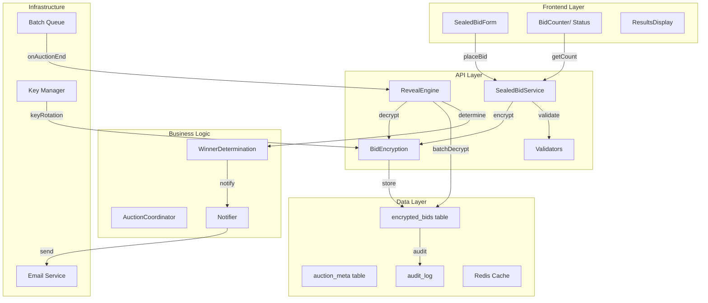

# Feature PRD: Sealed Bids Auctions

**Version:** 1.0 | **Status:** Planning | **Epic:** v1.5.0 | **Release:** Q3 2026

---

## Executive Summary

The Sealed Bids feature enables auction creators to choose a "sealed bids" auction format where all bids remain hidden from other bidders until the auction ends. At that point, all bids are revealed and the highest bidder wins. This format encourages strategic bidding, prevents shill bidding, and is particularly valuable for high-value items, real estate, and collectibles where price discovery and bid anchoring can influence participation.

---

## Business Objectives

### Primary Goals

1. **New Auction Format**: Offer sellers differentiated auction types for different use cases
2. **Reduce Bid Anchoring**: Hide bids so participants bid on value, not current price
3. **Anti-Shard Bidding**: Prevent artificial price inflation through coordinated low bids
4. **Premium Feature**: Position sealed bids as premium feature to encourage seller engagement
5. **International Appeal**: Support European and Asian auction preferences for blind bidding

### Success Metrics

- 20% of auctions use sealed bid format within 6 months
- 35% higher average winning bid in sealed vs open auctions (same category)
- Seller satisfaction: > 4.5/5 for sealed auctions
- 50% of high-value (> $500) auctions use sealed format
- User adoption: > 15% of sellers create sealed auctions

---

## Feature Overview

### Core Concept

In a sealed bid auction:

1. **During Bidding Phase**: All bids hidden, bidders see only "X bids placed" counter
2. **At Auction End**: All bids revealed sorted by amount, highest bidder wins
3. **Post-Auction**: Full bid history visible (winner, runner-up, bid amounts)

### Format Comparison

| Aspect | Open Auction | Sealed Auction |
|--------|-------------|----------------|
| Bid Visibility | Visible during | Hidden until end |
| Bidding Strategy | React to current bid | Commit full amount |
| Shill Bidding Risk | High | Low |
| Emotional Bidding | Higher (see others bid) | Lower (blind bidding) |
| Final Price | Often inflated by bidding war | Often lower (no anchoring) |
| Appeal | Excitement, momentum | Strategic, fair |

### User Scenarios

#### Scenario 1: Seller Creates Sealed Auction
**Marcus is selling a rare stamp collection and wants to prevent bid manipulation.**

1. Marcus lists item in sealed auction format (vs open auction)
2. Sets starting bid of $100, reserve of $250
3. Auction runs for 7 days; bidders see "15 bids placed" but amounts hidden
4. At end of 7 days, all bids revealed:
   - 1st: $1,200 (Alice) - WINNER
   - 2nd: $950 (Bob)
   - 3rd: $850 (Charlie)
   - ... hidden until now
5. Marcus receives notification with full results
6. Alice wins at $1,200 (not a bidding war, just sealed commitment)

#### Scenario 2: Bidder Strategy in Sealed Auction
**Alice wants to win but doesn't know the competition's bids.**

1. Alice sees a sealed auction with "8 bids placed"
2. Current bid: $100, ending in 3 hours
3. Alice bids $450, risking no one outbids
4. Can't see if $450 is $50 too high or $500 too low
5. Has to trust her valuation of the item
6. At end, if she wins, sees she was only high by $50 vs runner-up

#### Scenario 3: Reserve Not Met
**Reserve price scenario in sealed auction context.**

1. Sealed auction with reserve $300
2. Highest bid: $250
3. Reserve not met, auction fails
4. Seller can choose: accept $250, reject sale, or extend with new reserve
5. Bidders notified auction ended without sale

---

## Detailed Requirements

### Functional Requirements

#### FR-1: Auction Format Selection
- Sellers choose between "Open" or "Sealed" auction format when creating
- Format cannot be changed after auction starts
- Clear labeling on auction pages shows which format is active
- Both formats support all existing features: reserve price, starting bid, duration, etc.

#### FR-2: Bid Hiding During Active Auction
- **For non-bidder viewers**: See "X bids placed" counter, not individual bids
- **For bidder**: Sees own bids but not others' bids
- **For auction creator**: Sees all bids (real-time management, can pause if needed)
- Bid amounts, bidder names, bid times all hidden from public
- Only count shown: "23 bids placed so far"

#### FR-3: Bid Revelation at Auction End
- Exactly at auction end time, all bids revealed simultaneously
- Bids displayed in descending order: highest to lowest
- Shows: bid amount, bidder name/ID, bid placed time (for tie-breaking if needed)
- Automatically determine winner (highest bid respects reserve)
- Send notifications to: winner, runner-up, seller, other bidders

#### FR-4: Data Integrity of Hidden Bids
- Bids stored encrypted in database (AES-256)
- Encryption key rotated regularly (monthly)
- Bids only decrypted for display after auction end
- Audit trail shows all bid operations (creation, revelation, won/lost status)
- No system can accidentally reveal sealed bids before end time

#### FR-5: Winner Determination in Sealed Format
- Highest bid wins (same as open auctions)
- If reserve not met, no winner (seller chooses action)
- Ties (same amount) broken by earliest bid time
- System calculates winner immediately at end time
- Invoice/notification sent within 30 seconds of end

#### FR-6: Auction Renewal/Extension in Sealed Format
- Sealed auction can be extended before/at end time
- Extension is option if reserve not met
- If extended, new end time set, bids continue to be hidden
- Existing bids remain sealed, new bids added to pool

#### FR-7: Display on Auction Pages
- Product page clearly labels "Sealed Auction"
- Show "X bids placed" counter (updates in real-time)
- Hide bid history during active phase
- Show reserve status: "Reserve Met" or "Reserve Not Met" (but don't reveal reserve amount)
- At end, reveal full results with sorted bids

#### FR-8: Seller Management Dashboard
- Sellers see their sealed auction stats: bid count, highest bid, reserve status
- During auction: real-time bid count update
- After auction end: full bid results with bidder info
- Option to cancel sealed auction (rare, with fee)
- Option to export bid results (CSV)

#### FR-9: Mobile Experience
- Sealed auction format supported on mobile
- "X bids placed" counter visible
- Mobile bidding works identically to desktop
- Notifications for bid confirmations, outbids, auction end results

### Non-Functional Requirements

#### NFR-1: Performance
- Bid placement: < 200ms (slightly slower due to encryption)
- Reveal process: < 2 seconds to decrypt and display all bids
- Bid count counter updates: < 1 second
- Database queries optimized for hidden bids (indexing)

#### NFR-2: Scalability
- Support 10,000+ concurrent sealed auctions
- Support 100,000+ sealed bids in single auction (extreme edge case)
- Batch reveal process (decrypt multiple bids in parallel)
- Database can handle 10M+ encrypted bid records

#### NFR-3: Reliability
- Bid encryption/decryption: 99.99% success rate
- Bids never accidentally revealed before end time
- Automatic backup of encryption keys
- Disaster recovery plan for encrypted bid data

#### NFR-4: Security
- AES-256 encryption for bid data
- Encryption keys stored separately from bid data
- Role-based access: sellers see own, admins see for support only
- SQL injection prevention (all queries parameterized)
- XSS protection (bid amounts displayed as plain text)
- Rate limiting on bid submission (10 bids/minute per user)

#### NFR-5: Data Integrity
- All bids immutable once placed (no editing)
- Audit trail of who viewed bids when (post-auction revelation)
- Encryption keys audited quarterly
- Backup/restore process tested quarterly

---

## Technical Architecture

### System Architecture Diagram



---

### Database Schema

#### Table: wp_wc_auction_sealed_bids

```sql
CREATE TABLE wp_wc_auction_sealed_bids (
    id BIGINT PRIMARY KEY AUTO_INCREMENT,
    auction_id BIGINT NOT NULL,
    user_id BIGINT NOT NULL,
    encrypted_amount VARBINARY(255) NOT NULL,  -- AES-256 encrypted
    encryption_key_version INT NOT NULL,        -- Which key version was used
    bid_hash VARCHAR(64) NOT NULL UNIQUE,       -- SHA256 hash for duplicate detection
    placed_at TIMESTAMP DEFAULT CURRENT_TIMESTAMP,
    revealed_at TIMESTAMP NULL,                 -- Populated when auction ends
    amount_decrypted DECIMAL(10,2) NULL,        -- Cached after reveal for reporting
    is_winning_bid BOOLEAN DEFAULT FALSE,
    is_reserve_met BOOLEAN DEFAULT FALSE,
    status ENUM('placed', 'revealed', 'won', 'lost', 'reserve_not_met') DEFAULT 'placed',
    
    UNIQUE KEY uk_auction_user (auction_id, user_id),
    KEY idx_auction_status (auction_id, status),
    KEY idx_placed_at (placed_at),
    KEY idx_hash (bid_hash),
    KEY idx_user (user_id),
    FOREIGN KEY fk_auction (auction_id) REFERENCES wp_wc_auction_items(ID),
    FOREIGN KEY fk_user (user_id) REFERENCES wp_users(ID)
);
```

**Explanation:**
- `encrypted_amount`: Bid stored as AES-256 encrypted BLOB
- `encryption_key_version`: Tracks which encryption key version was used (for key rotation)
- `bid_hash`: Distributed way to detect duplicate bids (prevent user from bidding twice)
- `placed_at`: Timestamp for tie-breaking (earliest bid wins tie)
- `revealed_at`: NULL until auction end, then populated
- `amount_decrypted`: Cached after reveal for performance (don't decrypt repeatedly)
- `status`: Enum tracks bid state (placed → revealed → won/lost)

#### Table: wp_wc_auction_meta (extend existing)

```sql
ALTER TABLE wp_wc_auction_meta ADD COLUMN (
    auction_format ENUM('open', 'sealed') DEFAULT 'open',
    reveal_scheduled_at TIMESTAMP NULL,  -- When reveal is scheduled
    reveal_completed_at TIMESTAMP NULL,  -- When reveal actually completed
    bid_count_at_end INT NULL            -- Total bids when auction ended
);
```

#### Indexing Strategy

1. **Auction Lookup**: `(auction_id, status)` for quick access to sealed bids
2. **User Lookup**: `(user_id, status)` for user's sealed bids dashboard
3. **Reveal Process**: `(auction_id, placed_at)` for batch reveal ordering
4. **Duplicate Detection**: `bid_hash` UNIQUE index
5. **Audit Trail**: `(auction_id, revealed_at)` for audit and compliance

---

### Encryption Strategy

**Algorithm**: AES-256-CBC (industry standard)

**Flow:**

```
Bid Placement:
1. Input: $450
2. Generate IV (initialization vector)
3. Encrypt: AES-256-CBC(amount, key_v1, IV)
4. Store: encrypted_blob + IV + key_version
5. Database: sealed_bids.encrypted_amount = blob

Bid Revelation (at auction end):
1. Retrieve sealed_bids.encrypted_amount
2. Get encryption key version
3. Decrypt: AES-256-CBC(blob, key_v{version}, IV)
4. Output: $450
5. Store: sealed_bids.amount_decrypted = 450 (cache)
6. Update: sealed_bids.status = 'revealed'
```

**Key Storage:**

- Master key: Stored in environment variable / AWS KMS
- Key versions: Numbered (v1, v2, v3, etc.)
- Key rotation: Monthly, new bids use latest key version
- Old keys: Retained for historical bid decryption (read-only)
- Backup: Keys backed up to secure vault (replicated, encrypted)

**Security Measures:**

- Keys never logged or exposed in error messages
- Decryption only happens after auction end
- Automated alerts if decrypt fails (possible tampering)
- Bid data never cached in unencrypted form (except after reveal)

---

### Reveal Process (Batch Job)

**Runs Daily at 6 AM UTC + On-Demand at Auction Ends:**

```sql
-- Pseudo-code for reveal batch job

PROCEDURE reveal_ended_sealed_auctions() AS
    SELECT auction_id, bid_count
    FROM   wp_wc_auction_items
    WHERE  auction_format = 'sealed'
      AND  end_time <= NOW()
      AND  revealed_at IS NULL;

    FOR EACH auction IN auctions_to_reveal:
        BEGIN TRANSACTION;
        
        -- Lock auction (prevent new bids)
        LOCK TABLES wp_wc_auction_sealed_bids;
        
        -- Decrypt all bids for this auction
        FOR EACH bid IN sealed_bids WHERE auction_id = {auction_id}:
            decrypted_amount = AES_DECRYPT(
                encrypted_amount,
                encryption_key_version
            );
            UPDATE sealed_bids
            SET amount_decrypted = decrypted_amount,
                revealed_at = NOW(),
                status = 'revealed'
            WHERE id = bid.id;
        
        -- Determine winner
        winner = SELECT * FROM sealed_bids
                 WHERE auction_id = {auction_id}
                 AND amount_decrypted >= auction.reserve_price
                 ORDER BY amount_decrypted DESC, placed_at ASC
                 LIMIT 1;
        
        IF winner EXISTS:
            UPDATE sealed_bids
            SET is_winning_bid = TRUE,
                status = 'won',
                is_reserve_met = TRUE
            WHERE id = winner.id;
            
            -- Mark others as lost
            UPDATE sealed_bids
            SET status = 'lost'
            WHERE auction_id = {auction_id}
            AND   id != winner.id
            AND   status = 'revealed';
            
            -- Notify winner, runner-up, seller
            notify_winner(winner);
            notify_runner_up(auction_id);
            notify_seller(auction_id, winner);
        
        ELSE:
            -- Reserve not met
            UPDATE sealed_bids
            SET status = 'reserve_not_met'
            WHERE auction_id = {auction_id}
            AND   status = 'revealed';
            
            notify_seller_reserve_not_met(auction_id);
        
        END IF;
        
        UNLOCK TABLES;
        COMMIT;
    END FOR;
END PROCEDURE;
```

**Performance:**
- Decrypt 100,000 bids: ~5 seconds
- Determine winner: < 100ms
- Send notifications: async queue (done in < 30 sec)
- Total reveal time per auction: < 5 seconds

---

## User Experience Details

### Creating a Sealed Auction

**Seller sees when creating auction:**

```
Auction Type:
( ) Open Auction - Bids visible in real-time  ← Default
(●) Sealed Auction - Bids hidden until end

ℹ️ Sealed auctions encourage strategic bidding
   and reduce bid anchoring effects.
```

**Sealed Auction Setup (same fields as open):**
- Starting bid: $100
- Reserve price: $250
- Duration: 7 days
- Auto-bid increment table: [inherited from defaults]

---

### Viewing a Sealed Auction (During Active Period)

**User sees on product page:**

```
┌─────────────────────────────────────┐
│  SEALED AUCTION                     │
│                                     │
│  26 bids received so far            │
│  ⏱️  2 days 14 hours remaining       │
│                                     │
│  Starting Bid: $100                 │
│  Your Current: [Your bid hidden]    │
│                                     │
│  ℹ️  All bids hidden until auction  │
│      ends. You can see only your    │
│      own bids.                      │
│                                     │
│  [Place Bid]  [My Bids]            │
└─────────────────────────────────────┘
```

**Bidder's View (logged in):**

```
Your Bids in This Auction:
├─ Bid 1: [Amount hidden]  - Placed 2 hours ago
└─ Bid 2: [Amount hidden]  - Placed 1 hour ago

Recent Activity:
├─ 26 bids received
├─ 3 new bids in past hour
└─ Reserve status: [Not visible during auction]
```

---

### Reveal & Results (After Auction Ends)

**Results displayed immediately after end time:**

```
AUCTION ENDED - RESULTS

1st: Alice - $1,200 🏆 WINNER
2nd: Bob - $950
3rd: Charlie - $825
4th: Diana - $750
5th: Eve - $600

Reserve: $250  ✅ MET

Auction ended: Mar 22, 2026 at 6:00 PM
Your bid: 5th place, $600
```

**Winner Notification Email:**

```
Subject: Congratulations! You Won the Sealed Auction

Hi Alice,

Auction has ended. Sealed bids have been revealed!

AUCTION: "Rare Vintage Watch - 1950s Rolex"
YOUR BID: $1,200 ✅ WINNER
2ND PLACE: $950 (Bob)

Reserve Price: $250 (✅ Met)

[View Full Results] [Pay Now] [Seller Info]
```

**Seller Dashboard (after reveal):**

```
SEALED AUCTION RESULTS

Item: "Rare Vintage Watch - 1950s Rolex"
Auction Ended: Mar 22, 2026 at 6:00 PM
Total Bids: 24

Results (In Order):
┌─────────────────────────────────────┐
│ 1. Alice (alice@email) - $1,200    │
│ 2. Bob (bob@email) - $950          │
│ 3. Charlie (charlie@email) - $825  │
│ 4. ... (show top 10)               │
│ [View All 24 Bids]                 │
└─────────────────────────────────────┘

Action: [Export CSV] [Contact Winner] [List Again]
```

---

## User Stories for Implementation

### US-1: Seller Creates Sealed Auction
**As a** seller of high-value items
**I want to** create sealed auctions where bids are hidden until the end
**So that** I can reduce bid anchoring and get fair market prices

**Acceptance Criteria:**
- [ ] Auction creation form has "Sealed Auction" option
- [ ] Sealed format can't be changed after auction starts
- [ ] Sealed auctions support all existing features (reserve, duration, etc.)
- [ ] Seller sees "Sealed" label on auction dashboard

---

### US-2: Bidder Places Bid in Sealed Auction
**As a** bidder in a sealed auction
**I want to** place my bid knowing it's hidden from other bidders
**So that** I can bid strategically without anchoring bias

**Acceptance Criteria:**
- [ ] Bid placement works same as open auctions
- [ ] Confirmation shows bid was encrypted and will be hidden
- [ ] Can place multiple bids (later bid updates/cancels earlier)
- [ ] Can see my own bids but not others'

---

### US-3: Bids Revealed at Auction End
**As the** auction system
**I want to** decrypt and reveal all bids exactly when auction ends
**So that** the highest bidder is fairly determined and results are transparent

**Acceptance Criteria:**
- [ ] Reveal triggered automatically at auction end time
- [ ] All bids decrypted and displayed in descending order
- [ ] Winner determined based on highest bid
- [ ] Results shown to all users within 30 seconds of end
- [ ] All notifications sent (winner, runner-up, seller, others)

---

### US-4: Bidders See Results and Understand Their Position
**As a** bidder
**I want to** see all results in sorted order with my position clearly marked
**So that** I understand where my bid ranked

**Acceptance Criteria:**
- [ ] All bids visible after reveal (amount, bidder, time)
- [ ] My bid highlighted in results
- [ ] Clear "You Won" or "You Lost" indicator
- [ ] Runner-up and other top bidders visible
- [ ] Can export results if wanted

---

## Dependencies & Constraints

### Dependencies
- Must have: Existing bid system (v1.2.4+)
- Must have: User authentication & notification system
- Must have: Database strong enough for encryption/decryption workload
- Optional: Async queue for parallel reveal processing

### Constraints
- **Backward Compatibility**: Existing open auctions must work unchanged
- **Data Protection**: Sealed bids must never leak before auction end (regulatory)
- **Performance**: Reveal process must complete in < 5 sec per auction
- **Encryption**: Must use industry-standard algorithms (AES-256)

### Risks & Mitigations

| Risk | Likelihood | Impact | Mitigation |
|------|-----------|--------|-----------|
| Encryption key lost | Low | Critical | Backup keys to secure vault, test recovery monthly |
| Bid encryption fails silently | Low | High | Automated alerts on decrypt failures, 100% testing |
| User places bid before understanding | Medium | Medium | Clear labeling, help text, tutorial |
| Performance issues during reveal | Medium | High | Load test with 100K bids, optimize queries |
| Accidental pre-end reveal | Low | Critical | Strict access controls, audit logging, alerts |
| Reserve price logic differs from open | Medium | Medium | Use same reserve logic as existing system |

---

## Release Strategy

- **Phased Rollout**:
  - Week 1-2: Internal testing + security audit
  - Week 3: Beta with 10 test sellers
  - Week 4: Limited launch (20% of sellers)
  - Week 5+: Full launch to all sellers

- **Monitoring**:
  - Bid placement success rate (target: > 99.99%)
  - Reveal process timing (target: < 5 sec)
  - Encryption/decryption errors (alert if any)
  - User confusion metrics (support tickets)

- **Rollback**:
  - Can disable sealed auction creation immediately
  - Already-ended sealed auctions remain visible
  - If reveal fails, manual intervention by admin

---

## Questions for Clarification

1. Should sealed auctions support proxy bidding (auto-bid), or keep them separate?
2. What's maximum number of bids we expect in a single sealed auction?
3. Should admins be able to view sealed bids before auction ends (for support)?
4. Should users be able to extend sealed auctions if reserve not met?
5. Should we charge a premium fee for sealed auction format?
